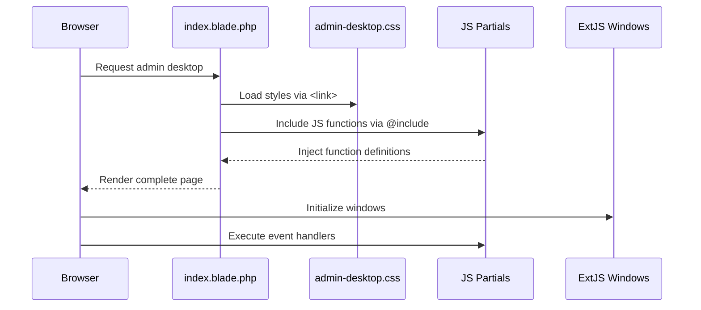

# Design Document: Admin Desktop Refactoring

## Overview

The admin desktop interface (`resources/views/admin/desktop/index.blade.php`) is a large monolithic Blade template (~4450+ lines) that implements a Windows 10-style desktop environment. This design document outlines the refactoring strategy to split the file into modular, maintainable components while preserving all functionality, comments, and documentation.

The refactoring will extract CSS into a separate stylesheet and JavaScript functions into individual Blade partial files, using Laravel's `@include()` directive for composition. This approach maintains the current execution model while improving code organization and maintainability.

## Main Algorithm/Workflow



## Architecture

### Current Structure (Before Refactoring)

```
resources/views/admin/desktop/
└── index.blade.php (~4450+ lines)
    ├── <head> section
    │   ├── External library links (ExtJS, GrapesJS, Material Icons)
    │   ├── Dynamic app JS includes (@foreach loop)
    │   └── <style> block (~1200 lines of CSS)
    ├── <body> section
    │   ├── Desktop HTML structure
    │   ├── Taskbar HTML
    │   ├── Start Menu HTML
    │   └── User Menu HTML
    └── <script> block (~3200 lines of JavaScript)
        ├── Global variables (moduleAccess, openWindows, etc.)
        ├── Utility functions (getMaxWindowZIndex, etc.)
        ├── UI functions (updateClock, toggleStartMenu, etc.)
        ├── Window management functions
        ├── Feature-specific functions (banners, users, permissions, etc.)
        └── IIFE blocks (drag-drop, context menu, initialization)
```

### Target Structure (After Refactoring)

```
resources/
├── css/
│   └── admin-desktop.css (extracted CSS)
└── views/admin/desktop/
    ├── index.blade.php (main template, ~250 lines)
    └── js/ (JavaScript partials)
        ├── _globals.blade.php (global variables)
        ├── _utils.blade.php (utility functions)
        ├── _clock.blade.php (clock functions)
        ├── _start-menu.blade.php (start menu functions)
        ├── _user-menu.blade.php (user menu functions)
        ├── _taskbar.blade.php (taskbar management)
        ├── _windows.blade.php (window management)
        ├── _banners.blade.php (banner CRUD functions)
        ├── _wholesaler-banners.blade.php (wholesaler banner functions)
        ├── _menu.blade.php (menu/pages management)
        ├── _permissions.blade.php (permissions management)
        ├── _users.blade.php (user management)
        ├── _drag-drop.blade.php (IIFE: drag-drop functionality)
        ├── _context-menu.blade.php (IIFE: context menu)
        └── _initialization.blade.php (IIFE: page load initialization)
```

### Architecture Diagram

```mermaid
graph TB
    subgraph "Main Template"
        A[index.blade.php]
    end
    
    subgraph "External Resources"
        B[admin-desktop.css]
        C[ExtJS Libraries]
        D[GrapesJS]
        E[Material Icons]
    end
    
    subgraph "JavaScript Partials"
        F[_globals.blade.php]
        G[_utils.blade.php]
        H[_clock.blade.php]
        I[_start-menu.blade.php]
        J[_user-menu.blade.php]
        K[_taskbar.blade.php]
        L[_windows.blade.php]
        M[_banners.blade.php]
        N[_wholesaler-banners.blade.php]
        O[_menu.blade.php]
        P[_permissions.blade.php]
        Q[_users.blade.php]
        R[_drag-drop.blade.php]
        S[_context-menu.blade.php]
        T[_initialization.blade.php]
    end
    
    A -->|<link>| B
    A -->|<script>| C
    A -->|<script>| D
    A -->|<link>| E
    
    A -->|@include| F
    A -->|@include| G
    A -->|@include| H
    A -->|@include| I
    A -->|@include| J
    A -->|@include| K
    A -->|@include| L
    A -->|@include| M
    A -->|@include| N
    A -->|@include| O
    A -->|@include| P
    A -->|@include| Q
    A -->|@include| R
    A -->|@include| S
    A -->|@include| T
    
    F -.->|provides globals| G
    F -.->|provides globals| K
    F -.->|provides globals| L
    G -.->|utility functions| L
    K -.->|taskbar API| L
    L -.->|window API| M
    L -.->|window API| N
    L -.->|window API| O
    L -.->|window API| P
    L -.->|window API| Q
```

## Core Interfaces/Types

### JavaScript Module Interface

Each JavaScript partial file follows this structure:

```javascript
<script>
// ============================================
// [Module Name] - [Brief Description]
// ============================================

/**
 * [Function Name]
 * 
 * [Description of what the function does]
 * 
 * @param {Type} paramName - Description
 * @return {Type} Description
 */
function functionName(paramName) {
    // Implementation
}

// Additional functions...

</script>
```

### IIFE Module Interface

IIFE (Immediately Invoked Function Expression) blocks are self-contained:

```javascript
<script>
// ============================================
// [Module Name] - [Brief Description]
// ============================================

(function() {
    // Private variables and functions
    
    // Initialization code
    
    // Event listeners
})();

</script>
```

### CSS Organization

The extracted CSS file will maintain the original structure with clear section comments:

```css
/* ============================================
   [Section Name]
   ============================================ */

.selector {
    property: value;
}
```

## Key Functions with Formal Specifications

### Function 1: Main Template Include Strategy

**File**: `resources/views/admin/desktop/index.blade.php`

```php
<!DOCTYPE html>
<html lang="ru">
<head>
    <!-- External libraries -->
    <link rel="stylesheet" href="https://fonts.googleapis.com/icon?family=Material+Icons">
    <link rel="stylesheet" href="https://cdnjs.cloudflare.com/ajax/libs/extjs/4.2.1/resources/css/ext-all.css">
    
    <!-- Extracted CSS -->
    <link rel="stylesheet" href="{{ asset('css/admin-desktop.css') }}">
    
    <!-- External scripts -->
    <script src="https://cdnjs.cloudflare.com/ajax/libs/extjs/4.2.1/ext-all.js"></script>
    <script src="https://cdnjs.cloudflare.com/ajax/libs/extjs/4.2.1/locale/ext-lang-ru.js"></script>
    
    <!-- Dynamic app includes -->
    @foreach($installed_apps as $app)
        @if(isset($moduleAccess[$app['app_id']]) && $moduleAccess[$app['app_id']] && $app['has_js_file'])
            <script src="/site/modules/admin/desktop/{{ $app['app_id'] }}_window.js?v={{ $app['version'] }}"></script>
        @endif
    @endforeach
</head>
<body>
    <!-- Desktop HTML structure -->
    <div class="desktop">
        <!-- Desktop shortcuts -->
    </div>
    
    <!-- Taskbar -->
    <div class="taskbar">
        <!-- Taskbar content -->
    </div>
    
    <!-- Start Menu -->
    <div id="start-menu-modal">
        <!-- Start menu content -->
    </div>
    
    <!-- User Menu -->
    <div id="user-menu">
        <!-- User menu content -->
    </div>
    
    <!-- JavaScript Modules -->
    {{-- Global Variables and Configuration --}}
    @include('admin.desktop.js._globals')
    
    {{-- Utility Functions --}}
    @include('admin.desktop.js._utils')
    
    {{-- UI Component Functions --}}
    @include('admin.desktop.js._clock')
    @include('admin.desktop.js._start-menu')
    @include('admin.desktop.js._user-menu')
    
    {{-- Window Management --}}
    @include('admin.desktop.js._taskbar')
    @include('admin.desktop.js._windows')
    
    {{-- Feature Modules --}}
    @include('admin.desktop.js._banners')
    @include('admin.desktop.js._wholesaler-banners')
    @include('admin.desktop.js._menu')
    @include('admin.desktop.js._permissions')
    @include('admin.desktop.js._users')
    
    {{-- IIFE Modules (Self-Executing) --}}
    @include('admin.desktop.js._drag-drop')
    @include('admin.desktop.js._context-menu')
    @include('admin.desktop.js._initialization')
</body>
</html>
```

**Preconditions:**
- All JavaScript partial files exist in `resources/views/admin/desktop/js/`
- CSS file exists at `public/css/admin-desktop.css`
- All extracted functions maintain their original signatures
- All comments are preserved in extracted files

**Postconditions:**
- Page renders identically to original
- All JavaScript functions are available in global scope
- Execution order is preserved
- No breaking changes to functionality

**Loop Invariants:** N/A

### Function 2: JavaScript Partial Extraction

**Template**: Individual function extraction pattern

```javascript
<script>
// ============================================
// [Original Comment Block Preserved]
// ============================================

/**
 * [Original function comment preserved]
 */
function originalFunctionName(param1, param2) {
    // Original implementation preserved
    // All comments preserved
}

</script>
```

**Preconditions:**
- Original function is identified and isolated
- Function dependencies are understood
- Function scope (global vs local) is determined
- All comments associated with function are captured

**Postconditions:**
- Function maintains exact same signature
- Function behavior is unchanged
- All comments are preserved
- Function is accessible in same scope as before

**Loop Invariants:** N/A

### Function 3: IIFE Block Extraction

**Template**: IIFE extraction pattern

```javascript
<script>
// ============================================
// [Original IIFE Comment Block Preserved]
// ============================================

(function() {
    // Original IIFE implementation preserved
    // All private variables preserved
    // All event listeners preserved
    // All comments preserved
})();

</script>
```

**Preconditions:**
- IIFE block is self-contained
- IIFE dependencies on global variables are identified
- IIFE execution timing requirements are understood

**Postconditions:**
- IIFE executes at same point in page load
- Private scope is maintained
- Event listeners are registered correctly
- No side effects on global scope beyond original intent

**Loop Invariants:** N/A

## Algorithmic Pseudocode

### Main Refactoring Algorithm

```pascal
ALGORITHM refactorAdminDesktop()
INPUT: Original index.blade.php file
OUTPUT: Refactored file structure with extracted CSS and JS partials

BEGIN
  // Step 1: Extract CSS
  cssContent ← extractStyleBlock(originalFile)
  createFile('public/css/admin-desktop.css', cssContent)
  
  // Step 2: Identify all JavaScript functions
  functions ← identifyFunctions(originalFile)
  
  // Step 3: Group functions by category
  functionGroups ← groupFunctionsByCategory(functions)
  
  // Step 4: Extract each function group to partial file
  FOR each group IN functionGroups DO
    partialContent ← buildPartialFile(group)
    fileName ← 'resources/views/admin/desktop/js/_' + group.name + '.blade.php'
    createFile(fileName, partialContent)
  END FOR
  
  // Step 5: Identify and extract IIFE blocks
  iifes ← identifyIIFEs(originalFile)
  FOR each iife IN iifes DO
    iifeContent ← buildIIFEPartial(iife)
    fileName ← 'resources/views/admin/desktop/js/_' + iife.name + '.blade.php'
    createFile(fileName, iifeContent)
  END FOR
  
  // Step 6: Build new main template with includes
  newTemplate ← buildMainTemplate(originalFile, functionGroups, iifes)
  backupFile(originalFile)
  createFile('resources/views/admin/desktop/index.blade.php', newTemplate)
  
  // Step 7: Verify functionality
  ASSERT allFunctionsAccessible()
  ASSERT executionOrderPreserved()
  ASSERT noBreakingChanges()
  
  RETURN success
END
```

**Preconditions:**
- Original file exists and is readable
- Target directories exist or can be created
- No syntax errors in original file
- All dependencies (ExtJS, etc.) are available

**Postconditions:**
- All CSS extracted to separate file
- All JavaScript functions extracted to partials
- Main template uses @include directives
- All functionality preserved
- All comments preserved
- File structure is organized and maintainable

**Loop Invariants:**
- Each extracted function maintains its original signature
- Each extracted file preserves all original comments
- Function execution order is maintained throughout extraction

### CSS Extraction Algorithm

```pascal
ALGORITHM extractStyleBlock(file)
INPUT: Original Blade file content
OUTPUT: CSS content string

BEGIN
  content ← readFile(file)
  
  // Find <style> tag
  styleStart ← findPosition(content, '<style>')
  styleEnd ← findPosition(content, '</style>')
  
  ASSERT styleStart > 0 AND styleEnd > styleStart
  
  // Extract CSS content between tags
  cssContent ← substring(content, styleStart + 7, styleEnd - styleStart - 7)
  
  // Preserve all comments
  ASSERT allCommentsPreserved(cssContent)
  
  RETURN cssContent
END
```

**Preconditions:**
- File contains exactly one <style> block
- Style block is well-formed
- All CSS is valid

**Postconditions:**
- Returns complete CSS content
- All comments preserved
- No HTML tags included in output

**Loop Invariants:** N/A

### Function Identification Algorithm

```pascal
ALGORITHM identifyFunctions(file)
INPUT: Original Blade file content
OUTPUT: Array of function objects

BEGIN
  content ← readFile(file)
  functions ← []
  
  // Find all function declarations
  pattern ← 'function\s+(\w+)\s*\([^)]*\)\s*\{'
  matches ← findAllMatches(content, pattern)
  
  FOR each match IN matches DO
    func ← {
      name: match.functionName,
      startPos: match.position,
      endPos: findMatchingBrace(content, match.position),
      comments: extractPrecedingComments(content, match.position),
      dependencies: analyzeDependencies(content, match)
    }
    
    functions.append(func)
  END FOR
  
  RETURN functions
END
```

**Preconditions:**
- File contains valid JavaScript
- All functions use standard function declaration syntax
- Braces are properly balanced

**Postconditions:**
- Returns array of all function definitions
- Each function object contains complete metadata
- Comments are associated with correct functions

**Loop Invariants:**
- All previously identified functions remain in array
- Function positions are in ascending order

### Function Grouping Algorithm

```pascal
ALGORITHM groupFunctionsByCategory(functions)
INPUT: Array of function objects
OUTPUT: Map of category → function array

BEGIN
  groups ← {
    'globals': [],
    'utils': [],
    'clock': [],
    'start-menu': [],
    'user-menu': [],
    'taskbar': [],
    'windows': [],
    'banners': [],
    'wholesaler-banners': [],
    'menu': [],
    'permissions': [],
    'users': []
  }
  
  FOR each func IN functions DO
    category ← categorizeFunction(func)
    groups[category].append(func)
  END FOR
  
  RETURN groups
END

FUNCTION categorizeFunction(func)
  // Categorize based on function name patterns
  IF func.name CONTAINS 'Clock' THEN
    RETURN 'clock'
  ELSE IF func.name CONTAINS 'StartMenu' OR func.name CONTAINS 'Menu' THEN
    RETURN 'start-menu'
  ELSE IF func.name CONTAINS 'User' AND NOT func.name CONTAINS 'show' THEN
    RETURN 'user-menu'
  ELSE IF func.name CONTAINS 'Taskbar' THEN
    RETURN 'taskbar'
  ELSE IF func.name CONTAINS 'Window' THEN
    RETURN 'windows'
  ELSE IF func.name CONTAINS 'Banner' AND NOT func.name CONTAINS 'Wholesaler' THEN
    RETURN 'banners'
  ELSE IF func.name CONTAINS 'WholesalerBanner' THEN
    RETURN 'wholesaler-banners'
  ELSE IF func.name CONTAINS 'Page' OR func.name CONTAINS 'Menu' THEN
    RETURN 'menu'
  ELSE IF func.name CONTAINS 'Permission' OR func.name CONTAINS 'Role' THEN
    RETURN 'permissions'
  ELSE IF func.name CONTAINS 'User' THEN
    RETURN 'users'
  ELSE IF func.name CONTAINS 'ZIndex' OR func.name CONTAINS 'Max' THEN
    RETURN 'utils'
  ELSE
    RETURN 'globals'
  END IF
END FUNCTION
```

**Preconditions:**
- Functions array is populated
- All functions have valid names
- Category map is initialized

**Postconditions:**
- All functions are assigned to exactly one category
- No functions are lost
- Categories are logically organized

**Loop Invariants:**
- Total number of functions remains constant
- Each function appears in exactly one category

## Example Usage

### Before Refactoring

```php
<!-- Original index.blade.php (excerpt) -->
<head>
    <style>
        .desktop {
            position: fixed;
            background: url('...') center center no-repeat;
        }
        /* ... 1200 more lines ... */
    </style>
</head>
<body>
    <!-- HTML structure -->
    
    <script>
        function updateClock() {
            var now = new Date();
            // ... implementation ...
        }
        
        function toggleStartMenu(event) {
            // ... implementation ...
        }
        
        // ... 100+ more functions ... 3200+ lines ...
    </script>
</body>
```

### After Refactoring

```php
<!-- Refactored index.blade.php -->
<head>
    <!-- External CSS -->
    <link rel="stylesheet" href="{{ asset('css/admin-desktop.css') }}">
</head>
<body>
    <!-- HTML structure -->
    
    {{-- Clock Functions --}}
    @include('admin.desktop.js._clock')
    
    {{-- Start Menu Functions --}}
    @include('admin.desktop.js._start-menu')
    
    {{-- ... other includes ... --}}
</body>
```

```php
<!-- resources/views/admin/desktop/js/_clock.blade.php -->
<script>
// ============================================
// Clock Functions
// ============================================

/**
 * Update the clock display in the taskbar
 * Shows current time and date in Russian format
 */
function updateClock() {
    var now = new Date();
    document.getElementById('clock-time').textContent = now.toLocaleTimeString('ru-RU', {hour: '2-digit', minute: '2-digit'});
    document.getElementById('clock-date').textContent = now.toLocaleDateString('ru-RU', {day: '2-digit', month: '2-digit', year: 'numeric'});
}

</script>
```

```php
<!-- resources/views/admin/desktop/js/_start-menu.blade.php -->
<script>
// ============================================
// Start Menu Functions - Windows 10 Style
// ============================================

/**
 * Toggle the Start Menu visibility
 * Prevents event bubbling to avoid immediate closure
 * 
 * @param {Event} event - Click event object
 */
function toggleStartMenu(event) {
    if (event) {
        event.stopPropagation();
    }
    var menu = document.getElementById('start-menu-modal');
    menu.classList.toggle('open');
}

/**
 * Close the Start Menu
 * Called when clicking outside the menu
 */
function closeStartMenu() {
    var menu = document.getElementById('start-menu-modal');
    menu.classList.remove('open');
}

</script>
```

```css
/* public/css/admin-desktop.css */

/* ============================================
   Base Styles
   ============================================ */

* {
    box-sizing: border-box;
}

body, html {
    margin: 0;
    padding: 0;
    width: 100%;
    height: 100%;
    overflow: hidden;
    font-family: 'Segoe UI', Tahoma, Geneva, Verdana, sans-serif;
}

/* ============================================
   Desktop - Windows 10 Background
   ============================================ */

.desktop {
    position: fixed;
    top: 0;
    left: 0;
    right: 0;
    bottom: 43px;
    background: url('https://images.frandroid.com/wp-content/uploads/2019/12/windows-10-wallpaper.jpg') center center no-repeat;
    background-size: cover;
    z-index: 1;
}

/* ... rest of CSS ... */
```

## Correctness Properties

### Property 1: Function Availability

```
∀ function f in original file:
  f is accessible in global scope after refactoring
  ⟺
  f is defined in exactly one partial file
  ∧
  partial file is included in main template
```

### Property 2: Execution Order Preservation

```
∀ functions f1, f2 where f1 is defined before f2 in original:
  f1 is available before f2 is called after refactoring
  ⟺
  @include for f1's partial appears before @include for f2's partial
  ∨
  f1 and f2 are in same partial with f1 defined first
```

### Property 3: Comment Preservation

```
∀ comment c in original file:
  c exists in refactored structure
  ⟺
  (c is in CSS file ∧ c was in <style> block)
  ∨
  (c is in partial file ∧ c was associated with function in that partial)
  ∨
  (c is in main template ∧ c was not in <style> or <script> blocks)
```

### Property 4: Scope Preservation

```
∀ variable v in original file:
  scope(v) after refactoring = scope(v) before refactoring
  ⟺
  (v is global ⟹ v is defined in _globals.blade.php)
  ∧
  (v is in IIFE ⟹ v is in same IIFE partial)
  ∧
  (v is function-local ⟹ v is in same function in partial)
```

### Property 5: Functionality Equivalence

```
∀ user interaction i:
  behavior(i) after refactoring = behavior(i) before refactoring
  ⟺
  all event handlers are preserved
  ∧
  all function calls resolve to same implementations
  ∧
  all CSS selectors match same elements
```

## Error Handling

### Error Scenario 1: Missing Partial File

**Condition**: An @include directive references a non-existent partial file

**Response**: Laravel will throw a `ViewNotFoundException` with clear error message indicating which partial is missing

**Recovery**: 
- Check that all partial files were created during refactoring
- Verify file naming matches @include directives
- Ensure file permissions allow reading

### Error Scenario 2: Function Dependency Violation

**Condition**: Function A calls function B, but B's partial is included after A's partial

**Response**: JavaScript runtime error: "B is not defined"

**Recovery**:
- Reorder @include directives to respect dependencies
- Move dependent functions to same partial file
- Use dependency analysis to determine correct order

### Error Scenario 3: Scope Leakage

**Condition**: Variable that should be private to IIFE is accessed globally

**Response**: JavaScript runtime error: "variable is not defined"

**Recovery**:
- Verify IIFE structure is preserved
- Check that variable is not accidentally declared in global scope
- Ensure IIFE is self-contained

### Error Scenario 4: CSS Selector Mismatch

**Condition**: CSS rule doesn't apply after extraction due to specificity or order changes

**Response**: Visual regression - elements don't appear as expected

**Recovery**:
- Verify CSS extraction preserved exact order
- Check for missing CSS rules
- Ensure no duplicate selectors with different rules
- Compare rendered styles before/after using browser DevTools

### Error Scenario 5: Event Handler Not Registered

**Condition**: IIFE that registers event handlers executes before DOM is ready

**Response**: Event handlers don't work, no errors in console

**Recovery**:
- Verify IIFE execution order
- Ensure initialization IIFE is included last
- Check that DOM elements exist before event registration
- Add DOMContentLoaded wrapper if needed

## Testing Strategy

### Unit Testing Approach

Since this is a refactoring with no functional changes, traditional unit tests are not applicable. Instead, we use:

1. **Manual Function Verification**
   - Test each UI interaction after refactoring
   - Verify clock updates every second
   - Test start menu open/close
   - Test window creation, minimization, maximization, closing
   - Test taskbar button behavior
   - Test all CRUD operations (banners, users, permissions, pages)

2. **Console Verification**
   - Open browser console
   - Verify no JavaScript errors
   - Check that all functions are defined: `typeof functionName !== 'undefined'`
   - Verify global variables are accessible

3. **Visual Regression Testing**
   - Take screenshots before refactoring
   - Take screenshots after refactoring
   - Compare pixel-by-pixel or visually
   - Verify all UI elements appear identical

### Property-Based Testing Approach

**Property Test Library**: Manual verification (no automated PBT for this refactoring)

**Properties to Verify**:

1. **Function Existence Property**
   - For every function in original file, verify it exists after refactoring
   - Test: `typeof originalFunction === 'function'`

2. **Execution Order Property**
   - Functions that depend on each other execute in correct order
   - Test: Call dependent function, verify no "not defined" errors

3. **Event Handler Property**
   - All event handlers registered in original are registered after refactoring
   - Test: Trigger each event, verify handler executes

4. **CSS Application Property**
   - All CSS rules apply to same elements after extraction
   - Test: Use `getComputedStyle()` to compare styles before/after

### Integration Testing Approach

1. **Full Workflow Testing**
   - Log in to admin panel
   - Open each application window from start menu
   - Perform CRUD operations in each module
   - Verify data persistence
   - Test window management (minimize, maximize, close, z-index)

2. **Cross-Browser Testing**
   - Test in Chrome, Firefox, Safari, Edge
   - Verify ExtJS compatibility
   - Check CSS rendering consistency

3. **Performance Testing**
   - Measure page load time before/after
   - Verify no performance regression
   - Check network requests (CSS file should be cached)

## Performance Considerations

### CSS Extraction Benefits

- **Caching**: Extracted CSS file can be cached by browser, reducing page load time on subsequent visits
- **Parallel Loading**: Browser can download CSS file in parallel with HTML parsing
- **Minification**: CSS file can be minified in production without affecting Blade template

### JavaScript Partial Considerations

- **No Performance Impact**: @include directives are processed server-side during Blade compilation
- **Compiled Output**: Final HTML contains all JavaScript inline, same as before
- **Development Speed**: Smaller files are easier to edit, reducing developer cognitive load

### Potential Optimizations (Future)

- Move JavaScript partials to external .js files for browser caching
- Implement JavaScript bundling and minification
- Use Laravel Mix or Vite for asset compilation
- Implement code splitting for large feature modules

## Security Considerations

### No Security Changes

This refactoring does not introduce any security changes:

- All code remains server-side rendered
- No new external dependencies
- No changes to authentication or authorization
- No changes to data validation or sanitization

### Security Best Practices Maintained

- Blade templating prevents XSS ({{ }} escaping)
- CSRF protection remains unchanged
- Session management unchanged
- Access control via `$moduleAccess` variable preserved

### Future Security Enhancements

- Consider moving sensitive configuration to .env
- Implement Content Security Policy (CSP) headers
- Add Subresource Integrity (SRI) for external libraries
- Audit ExtJS version for known vulnerabilities

## Dependencies

### Required Laravel Features

- **Blade Templating Engine**: For @include directives
- **Asset Helper**: For `asset()` function to generate CSS URLs
- **View Compilation**: Blade compiler must process all @include directives

### External Libraries (Unchanged)

- **ExtJS 4.2.1**: Window management framework
- **GrapesJS**: Page builder functionality
- **Google Material Icons**: Icon font
- **jQuery** (if used): DOM manipulation

### File System Requirements

- Write access to `resources/views/admin/desktop/js/` directory
- Write access to `public/css/` directory
- Read access to original `index.blade.php` for extraction

### Browser Compatibility

- Modern browsers with ES5 support (for existing JavaScript)
- CSS3 support for animations and transitions
- No new browser requirements introduced by refactoring

## Detailed Function Extraction Plan

### JavaScript Partials Structure

Based on analysis of the current file, here is the complete list of functions to extract:

#### 1. `_globals.blade.php` - Global Variables
- `moduleAccess` object (Blade-generated)
- `openWindows` object
- `profileWindow` variable
- `bannerPreviewWindow` variable

#### 2. `_utils.blade.php` - Utility Functions
- `getMaxWindowZIndex()` - Get maximum z-index of all windows
- `debugZIndex()` - Debug function for z-index inspection

#### 3. `_clock.blade.php` - Clock Functions
- `updateClock()` - Update taskbar clock display

#### 4. `_start-menu.blade.php` - Start Menu Functions
- `toggleStartMenu(event)` - Toggle start menu visibility
- `closeStartMenu()` - Close start menu

#### 5. `_user-menu.blade.php` - User Menu Functions
- `showProfile()` - Open user profile window
- `showUserMenu()` - Show user menu dropdown
- `closeUserMenu()` - Close user menu dropdown
- `logout()` - Logout with confirmation

#### 6. `_taskbar.blade.php` - Taskbar Management
- `addWindowToTaskbar(win)` - Add window button to taskbar
- `removeWindowFromTaskbar(winId)` - Remove window button from taskbar
- `updateTaskbarButton(winId, isActive, isMinimized)` - Update button state
- `addTaskbarButton(windowId, title, win)` - Alternative add function
- `removeTaskbarButton(windowId)` - Alternative remove function
- `setActiveWindow(windowId)` - Set active window styling

#### 7. `_windows.blade.php` - Window Management
- ExtJS Window override configuration
- Window initialization helpers

#### 8. `_banners.blade.php` - Banner Management
- `showBannerPreview(imageUrl)` - Show banner in full size
- `showBannerForm(record, store)` - Add/edit banner form
- `deleteBanner(record, store)` - Delete banner with confirmation
- `openBanners()` - Open banners management window

#### 9. `_wholesaler-banners.blade.php` - Wholesaler Banner Management
- `showWholesalerBannerForm(record, store)` - Add/edit wholesaler banner form
- `deleteWholesalerBanner(record, store)` - Delete wholesaler banner
- `openWholesalerBanners()` - Open wholesaler banners window

#### 10. `_menu.blade.php` - Menu/Pages Management
- `openMenu()` - Open menu management window
- `showPageFormForNode(node, parentId)` - Create page form
- `deletePageNode(node)` - Delete page node
- `loadPageContent(pageId)` - Load page content
- `showPageEditor(pageData, store)` - Show page editor
- `showPageForm(record, store, parentId)` - Add/edit page form
- `deletePage(record, store)` - Delete page

#### 11. `_permissions.blade.php` - Permissions Management
- `openPermissions()` - Open permissions window
- `loadRolePermissions(roleId)` - Load role permissions
- `showPermissionsGrid(role, permissions)` - Show permissions grid
- `saveRolePermissions(roleId, store)` - Save role permissions
- `showChangeRoleForm(userRecord, usersStore, rolesStore)` - Change user role
- `loadUserModuleAccess(userId)` - Load user module access
- `showUserModulesGrid(user, modules)` - Show user modules grid
- `saveUserModuleAccess(userId, store)` - Save user module access
- `resetUserModuleAccess(userId, store)` - Reset to role permissions

#### 12. `_users.blade.php` - User Management
- `openUsers()` - Open users management window
- `showUserForm(record, store)` - Add/edit user form
- `showPasswordForm(record, store)` - Change password form
- `toggleUserActive(record, store)` - Block/activate user
- `deleteUser(record, store)` - Delete user

#### 13. `_drag-drop.blade.php` - IIFE: Drag & Drop
- Desktop icon drag and drop functionality
- `arrangeIconsToGrid()` - Arrange icons to grid
- `deleteIcon(icon)` - Delete desktop icon
- Position saving/loading

#### 14. `_context-menu.blade.php` - IIFE: Context Menu
- Right-click context menu for desktop icons
- Context menu event handlers

#### 15. `_initialization.blade.php` - IIFE: Page Initialization
- DOMContentLoaded event handlers
- Start button click handler
- Click outside menu handlers
- Clock initialization (`updateClock()` call and `setInterval`)
- ExtJS onReady configuration

### CSS Extraction Plan

Extract entire `<style>` block (~1200 lines) to `public/css/admin-desktop.css` with sections:
- Base styles (*, body, html)
- Desktop styles (.desktop, .desktop-shortcuts, .shortcut)
- Desktop logo (.desktop-logo)
- Taskbar styles (.taskbar, .start-button, .window-button)
- System tray (.system-tray, .tray-button, .clock)
- Start menu (#start-menu-modal)
- User menu (#user-menu)
- Context menu (.context-menu)
- ExtJS window overrides (.x-window, .x-window-header)
- Windows 10 settings styles (.win10-settings)
- GrapesJS styles (#gjs-editor)

## Implementation Notes

### Refactoring Sequence

1. **Backup Original File**: Create `index.blade.php.backup` before any changes
2. **Extract CSS First**: Lowest risk, easy to verify
3. **Extract Simple Functions**: Start with utility functions, clock, menus
4. **Extract Complex Functions**: Window management, CRUD operations
5. **Extract IIFE Blocks Last**: Most complex due to scope considerations
6. **Test After Each Extraction**: Verify functionality before proceeding

### Comment Preservation Strategy

- **Function Comments**: Include all comments immediately preceding function definition
- **Inline Comments**: Preserve all comments within function body
- **Section Comments**: Preserve section headers in partial files
- **Main Template Comments**: Add comments indicating what each @include provides

### Naming Conventions

- **Partial Files**: Use underscore prefix (`_filename.blade.php`) to indicate partial
- **File Names**: Use kebab-case matching category names (`_start-menu.blade.php`)
- **Descriptive Names**: File name should clearly indicate contents

### Blade Directive Best Practices

- **Use @include**: Not @includeIf or @includeWhen (files must exist)
- **No Parameters**: Partials don't need parameters, they access global scope
- **Consistent Indentation**: Maintain readable structure in main template
- **Grouped Includes**: Group related includes with comments

### Verification Checklist

After refactoring, verify:

- [ ] All CSS rules present in extracted file
- [ ] All functions defined in partials
- [ ] All IIFE blocks extracted
- [ ] Main template includes all partials in correct order
- [ ] No JavaScript errors in browser console
- [ ] All UI interactions work identically
- [ ] Visual appearance unchanged
- [ ] Page load time not significantly increased
- [ ] All comments preserved
- [ ] Code is more maintainable and readable
