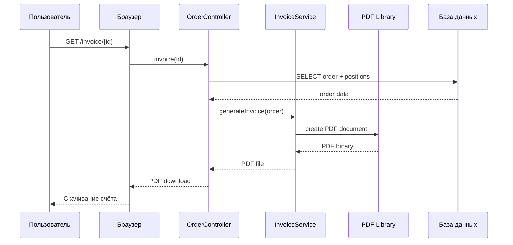
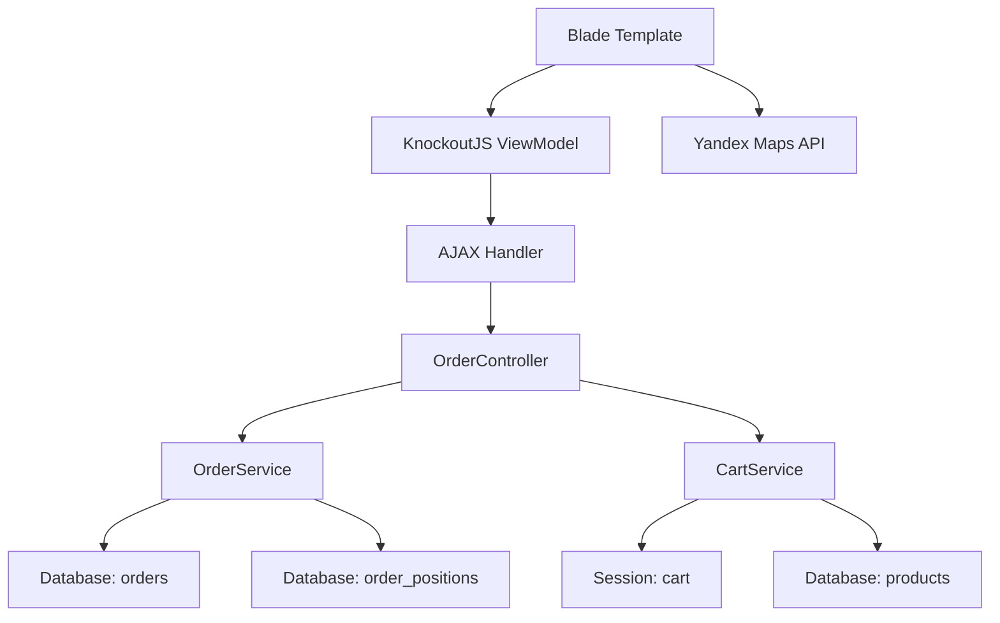

# Design Document: Checkout Order Implementation

## Overview

Реализация критичного модуля оформления заказа и управления заказами для интернет-магазина "Сфера" на Laravel 12. Модуль включает полный цикл работы с заказами: оформление заказа с формой и валидацией, создание заказа в БД с транзакционной целостностью, страницу благодарности, список заказов пользователя, детали заказа и генерацию счёта на оплату в PDF. Сохраняется интеграция с KnockoutJS для реактивного отображения корзины. Без этого функционала магазин не работает - пользователи не могут завершить покупку.

## Main Workflows

### Workflow 1: Оформление заказа (Checkout Flow)

```mermaid
sequenceDiagram
    participant User as Пользователь
    participant Browser as Браузер
    participant Controller as OrderController
    participant Service as OrderService
    participant Cart as CartService
    participant DB as База данных
    
    User->>Browser: GET /checkout
    Browser->>Controller: checkout()
    Controller->>Cart: getCartData()
    Cart->>DB: SELECT products, prices
    DB-->>Cart: product data
    Cart-->>Controller: cart data (JSON)
    Controller-->>Browser: checkout view + cart data
    Browser-->>User: Форма оформления заказа
    
    User->>Browser: Заполняет форму + нажимает "Оформить"
    Browser->>Controller: POST /checkout (AJAX)
    Controller->>Service: createOrder(orderData)
    Service->>Service: validateOrderData()
    Service->>Service: generateOrderNumber()
    Service->>DB: BEGIN TRANSACTION
    Service->>DB: INSERT order_positions (loop)
    Service->>DB: INSERT orders
    Service->>DB: COMMIT
    Service->>Cart: clearCart()
    Service->>Session: save order data
## Architecture

### Общая архитектура системы

```mermaid
graph TD
    A[OrderController] --> B[OrderService]
    A --> C[CartService]
    A --> D[InvoiceService]
    
    B --> E[Database: orders]
    B --> F[Database: order_positions]
    
    C --> G[Session: cart]
    C --> H[Database: products]
    C --> I[Database: prices]
    
    D --> J[PDF Library: TCPDF/DomPDF]
    D --> E
### Слои архитектуры

1. **Presentation Layer** (Blade + KnockoutJS)
   - `resources/views/checkout/index.blade.php` - форма оформления заказа
   - `resources/views/thankyoupage/index.blade.php` - страница благодарности
   - `resources/views/orders/index.blade.php` - список заказов
   - `resources/views/orders/show.blade.php` - детали заказа
   - `public/assets/sfera/js/checkout.js` - клиентская логика оформления
   - `public/assets/sfera/css/checkout.css` - стили оформления
   - Интеграция с `cart-viewmodel.js` (KnockoutJS) для реактивного отображения корзины

2. **Application Layer** (Controllers)
   - `app/Http/Controllers/OrderController.php`
     - `checkout()` - GET: отображение формы оформления
     - `placeOrder()` - POST: создание заказа (AJAX)
     - `thankyoupage()` - GET: страница благодарности
     - `index()` - GET: список заказов пользователя
     - `show($id)` - GET: детали заказа
     - `invoice($id)` - GET: генерация счёта PDF

3. **Business Logic Layer** (Services)
   - `app/Services/OrderService.php` - логика создания и управления заказами
   - `app/Services/InvoiceService.php` - генерация счетов PDF
## Components and Interfaces

### Component 1: OrderController

**Purpose**: HTTP контроллер для обработки всех запросов, связанных с заказами

**Interface**:
```php
class OrderController extends Controller
{
    // Оформление заказа
    public function checkout(): View
    public function placeOrder(Request $request): JsonResponse
    
    // Страница благодарности
    public function thankyoupage(): View
    
    // Список и детали заказов
    public function index(Request $request): View
    public function show(int $id): View
    
    // Генерация счёта
    public function invoice(int $id): Response
}
```

**Responsibilities**:
- Отображение формы оформления заказа (GET /checkout)
- Валидация входящих данных через Request
- Делегирование бизнес-логики в OrderService
- Возврат JSON ответа для AJAX запросов
- Отображение страницы благодарности с данными заказа
- Отображение списка заказов пользователя с фильтрацией
- Отображение деталей конкретного заказа
- Генерация и отдача PDF счёта

**Dependencies**:
- `OrderService` - создание и управление заказами
- `CartService` - получение данных корзины
- `InvoiceService` - генерация счетов PDF

### Component 2: OrderService

**Purpose**: Бизнес-логика создания и управления заказами

**Interface**:
```php
class OrderService
{
    // Создание заказа
    public function createOrder(array $orderData, array $cartItems): array
    
    // Получение заказов пользователя
    public function getUserOrders(int $userId, array $filters = []): Collection
    
    // Получение деталей заказа
    public function getOrderDetails(int $orderId, int $userId): ?array
    
    // Приватные методы
    private function validateOrderData(array $orderData): void
    private function generateOrderNumber(): array
    private function createOrderPositions(int $orderNum, string $orderCode, array $cartItems): float
    private function createOrderRecord(int $orderNum, string $orderCode, array $orderData, float $totalSum): void
    private function getClientIp(): string
}
```

**Responsibilities**:
## Data Models

### Model 1: Order (таблица orders)

```php
interface Order
{
    id: int                    // order_num - уникальный номер заказа (PK)
    order_code: string         // строковый код заказа (base36, UK)
    date_init: datetime        // дата создания заказа
    status: int                // статус заказа (1=новый, 2=оплачен, 3=доставлен, 4=отменен)
    full_sum: float            // полная сумма товаров
    discount_sum: float        // сумма скидки
    pay_sum: float             // итоговая сумма к оплате
    bonus: float               // бонусы (если применены)
    cart_weight: float         // общий вес корзины
    cart_volume: float         // объем
    cart_density: float        // плотность
    name: string               // ФИО получателя
    phone: string              // телефон получателя
    email: string|null         // email (необязательно)
    comment_user: text|null    // комментарий пользователя
    tracking_id: string|null   // ID отслеживания доставки
    checkoutOrderId: string|null // ID заказа в системе доставки
    user_id: int               // ID пользователя (0 если гость)
    user_role: string|null     // роль пользователя
    user_card_code: string|null // код карты лояльности
    ip: string                 // IP адрес клиента
    user_agent: string         // User Agent браузера
}
```

**Validation Rules**:
- `id` (order_num) - уникальный, генерируется автоматически, положительное целое
- `order_code` - уникальный, генерируется автоматически, формат "XXX-XXX-XXX"
- `name` - обязательное, не пустое, max 255 символов
- `phone` - обязательное, не пустое, max 20 символов
- `email` - необязательное, валидный email если указан, max 255 символов
- `comment_user` - необязательное, max 1000 символов
- `full_sum`, `discount_sum`, `pay_sum`, `bonus` - неотрицательные числа
- `pay_sum` = `full_sum` - `discount_sum` (должно быть >= 0)
- `status` - целое число от 1 до 4
- `user_id` - целое число >= 0

**Индексы**:
- PRIMARY KEY: `id`
- UNIQUE KEY: `order_code`
- INDEX: `user_id` (для быстрого поиска заказов пользователя)
- INDEX: `status` (для фильтрации по статусу)
- INDEX: `date_init` (для сортировки по дате)

### Model 2: OrderPosition (таблица order_positions)

```php
interface OrderPosition
{
    id: int                    // auto increment (PK)
    created: datetime          // дата создания позиции
    order_num: int             // номер заказа (FK -> orders.id)
    order_code: string         // код заказа
    pieces: int                // количество товара
    min: int                   // минимальное количество
    bill: decimal              // цена за единицу (для учета)
    cost: decimal              // цена за единицу
    piece_cost: decimal        // цена за единицу (дубликат)
    amount: decimal            // количество (дубликат pieces)
    sum: decimal               // сумма (cost * pieces)
    art: string                // артикул товара
    guid: string               // ID товара (product_id, FK)
    title: string              // название товара
    model: string|null         // модель товара
    weight: float              // вес единицы товара
    w: float|null              // ширина в упаковке
    l: float|null              // длина в упаковке
    h: float|null              // высота в упаковке
    volume: float|null         // объем товара в упаковке
    piece_weight: float        // вес единицы (дубликат weight)
}
```

**Validation Rules**:
- `order_num` - должен существовать в таблице orders
- `guid` - должен существовать в таблице products
- `pieces`, `amount` - положительные целые числа
- `cost`, `piece_cost`, `bill` - неотрицательные числа
- `sum` = `cost` * `pieces` (должно совпадать)
- `title` - обязательное, не пустое
- `weight`, `piece_weight` - неотрицательные числа

**Индексы**:
- PRIMARY KEY: `id`
- INDEX: `order_num` (для быстрого поиска позиций заказа)
- INDEX: `guid` (для связи с товарами)
- INDEX: `order_code` (для поиска по коду заказа)

### Model 3: Product (таблица products) - существующая

```php
interface Product
{
    id: string                 // product_id (PK)
    name: string               // название товара
    description: text          // описание
    weight: float              // вес товара
    model: string              // модель
    quantity: int              // количество на складе
}
```

**Используется для**:
- Получение данных товара при создании позиции заказа
- Проверка наличия товара на складе
- Получение веса для расчета доставки

### Model 4: Price (таблица prices) - существующая

```php
interface Price
{
    product_id: string         // ID товара (FK)
    price_type_id: string      // тип цены ('000000002' = розничная)
    price: float               // цена товара
}
```

**Используется для**:
- Получение актуальной цены товара при создании заказа
- Расчет итоговой суммы заказаorder view + data
    Browser-->>User: Детали заказа
```

### Workflow 5: Генерация счёта (Invoice Generation)



## Architecture

### Компоненты системы



### Слои архитектуры

1. **Presentation Layer** (Blade + KnockoutJS)
   - `resources/views/checkout/index.blade.php` - основной шаблон
   - `public/assets/sfera/js/checkout.js` - клиентская логика
   - `public/assets/sfera/css/checkout.css` - стили
   - Интеграция с `cart-viewmodel.js` (KnockoutJS)

2. **Application Layer** (Controllers)
   - `app/Http/Controllers/OrderController.php`
     - `checkout()` - GET: отображение формы
     - `placeOrder()` - POST: создание заказа

3. **Business Logic Layer** (Services)
   - `app/Services/OrderService.php` - логика создания заказа
   - `app/Services/CartService.php` - работа с корзиной (уже существует)

4. **Data Layer** (Database)
   - Таблица `orders` - заказы
   - Таблица `order_positions` - позиции заказа
   - Таблица `products` - товары
   - Таблица `prices` - цены

## Components and Interfaces

### Component 1: OrderController

**Purpose**: HTTP контроллер для обработки запросов оформления заказа

**Interface**:
```php
class OrderController extends Controller
{
    public function checkout(): View
    public function placeOrder(Request $request): JsonResponse
}
```

**Responsibilities**:
- Отображение формы оформления заказа (GET /checkout)
- Валидация входящих данных через Request
- Делегирование бизнес-логики в OrderService
- Возврат JSON ответа для AJAX запросов

**Dependencies**:
- `OrderService` - создание заказа
- `CartService` - получение данных корзины

### Component 2: OrderService

**Purpose**: Бизнес-логика создания заказа

**Interface**:
```php
class OrderService
{
    public function createOrder(array $orderData, array $cartItems): array
    private function validateOrderData(array $orderData): void
    private function generateOrderNumber(): array
    private function createOrderPositions(int $orderNum, string $orderCode, array $cartItems): float
    private function createOrderRecord(int $orderNum, string $orderCode, array $orderData, float $totalSum): void
    private function getClientIp(): string
}
```


**Responsibilities**:
- Валидация данных заказа (ФИО, телефон обязательны)
- Генерация уникального номера заказа (order_num, order_code)
- Создание записей в order_positions для каждого товара
- Создание записи в orders
- Расчет итоговых сумм (full_sum, discount_sum, pay_sum)
- Получение IP адреса и User Agent клиента

### Component 3: CartService (существующий)

**Purpose**: Работа с корзиной пользователя

**Interface** (используемые методы):
```php
class CartService
{
    public function getCartData(array $cart = null): array
    public function clearCart(): array
}
```

**Responsibilities**:
- Получение данных корзины в формате для KnockoutJS
- Очистка корзины после создания заказа

## Data Models

### Model 1: Order (таблица orders)

```php
interface Order
{
    id: int                    // order_num - уникальный номер заказа
    order_code: string         // строковый код заказа (base36)
    full_sum: float            // полная сумма товаров
    discount_sum: float        // сумма скидки
    pay_sum: float             // итоговая сумма к оплате
    bonus: float               // бонусы (если применены)
    cart_weight: float         // общий вес корзины
    cart_volume: float         // объем
    cart_density: float        // плотность
    name: string               // ФИО получателя
    phone: string              // телефон получателя
    email: string|null         // email (необязательно)
    comment_user: string|null  // комментарий пользователя
    tracking_id: string|null   // ID отслеживания доставки
    checkoutOrderId: string|null // ID заказа в системе доставки
    user_id: int               // ID пользователя (0 если гость)
    user_role: string|null     // роль пользователя
    user_card_code: string|null // код карты лояльности
    ip: string                 // IP адрес клиента
    user_agent: string         // User Agent браузера
    created_at: timestamp      // дата создания
    updated_at: timestamp      // дата обновления
}
```


**Validation Rules**:
- `id` (order_num) - уникальный, генерируется автоматически
- `order_code` - уникальный, генерируется автоматически
- `name` - обязательное, не пустое
- `phone` - обязательное, не пустое
- `email` - необязательное, валидный email если указан
- `full_sum`, `discount_sum`, `pay_sum` - неотрицательные числа
- `pay_sum` = `full_sum` - `discount_sum`

### Model 2: OrderPosition (таблица order_positions)

```php
interface OrderPosition
{
    order_num: int             // номер заказа (FK -> orders.id)
    order_code: string         // код заказа
    pieces: int                // количество товара
    bill: float                // цена за единицу (для учета)
    cost: float                // цена за единицу
    piece_cost: float          // цена за единицу
    amount: int                // количество (дубликат pieces)
    sum: float                 // сумма (cost * pieces)
    art: string                // артикул товара
    guid: string               // ID товара (product_id)
    title: string              // название товара
    model: string|null         // модель товара
    weight: float              // вес единицы товара
    piece_weight: float        // вес единицы (дубликат weight)
}
```

**Validation Rules**:
- `order_num` - должен существовать в таблице orders
- `guid` - должен существовать в таблице products
- `pieces`, `amount` - положительные целые числа
- `cost`, `piece_cost`, `bill` - неотрицательные числа
- `sum` = `cost` * `pieces`

## Algorithmic Pseudocode

### Main Processing Algorithm: createOrder

```pascal
ALGORITHM createOrder(orderData, cartItems)
INPUT: orderData (name, phone, email, comment, delivery, payment)
       cartItems (массив товаров из корзины)
OUTPUT: result {success: boolean, order_num: int, redirect: string}

BEGIN
  // Precondition: cartItems не пустой
  ASSERT cartItems.length > 0
  
  // Step 1: Валидация данных заказа
  validateOrderData(orderData)
  ASSERT orderData.name IS NOT EMPTY
  ASSERT orderData.phone IS NOT EMPTY
  
  // Step 2: Генерация номера заказа
  orderKeys ← generateOrderNumber()
  ASSERT orderKeys.order_num > 0
  ASSERT orderKeys.order_code IS NOT EMPTY
  
  // Step 3: Создание позиций заказа
  totalSum ← 0
  FOR EACH item IN cartItems WHERE item.selected = true DO
    // Получаем данные товара из БД
    product ← SELECT FROM products WHERE id = item.guid
    
    IF product IS NULL THEN
      CONTINUE  // Пропускаем несуществующий товар
    END IF
    
    // Рассчитываем сумму позиции
    itemSum ← item.cost * item.product_amount
    totalSum ← totalSum + itemSum
    
    // Создаем запись в order_positions
    INSERT INTO order_positions (
      order_num, order_code, guid, title, pieces,
      cost, piece_cost, sum, weight, piece_weight
    ) VALUES (
      orderKeys.order_num, orderKeys.order_code,
      product.id, product.name, item.product_amount,
      item.cost, item.cost, itemSum,
      product.weight, product.weight
    )
  END FOR
  
  // Step 4: Расчет итоговых сумм
  fullSum ← totalSum
  discountSum ← SESSION['cart_discount'] OR 0
  paySum ← fullSum - discountSum
  IF paySum < 0 THEN
    paySum ← 0
  END IF
  
  // Step 5: Создание записи заказа
  INSERT INTO orders (
    id, order_code, full_sum, discount_sum, pay_sum,
    name, phone, email, comment_user,
    user_id, ip, user_agent
  ) VALUES (
    orderKeys.order_num, orderKeys.order_code,
    fullSum, discountSum, paySum,
    orderData.name, orderData.phone, orderData.email,
    orderData.comment_user,
    SESSION['user_id'] OR 0,
    getClientIp(), getUserAgent()
  )
  
  // Step 6: Очистка корзины
  SESSION['cart']['items'] ← {}
  SESSION['cart_discount'] ← 0
  SESSION['cart_promocode'] ← null
  
  // Postcondition: Заказ создан, корзина очищена
  ASSERT EXISTS (SELECT FROM orders WHERE id = orderKeys.order_num)
  ASSERT SESSION['cart']['items'] IS EMPTY
  
  RETURN {
    success: true,
    order_num: orderKeys.order_num,
    redirect: '/thankyoupage/'
  }
END
```


**Preconditions:**
- `cartItems` не пустой массив
- `orderData.name` и `orderData.phone` заполнены
- Товары в корзине существуют в БД
- Сессия инициализирована

**Postconditions:**
- Создана запись в таблице `orders` с уникальным `order_num`
- Созданы записи в таблице `order_positions` для всех выбранных товаров
- Корзина очищена в сессии
- Возвращен JSON с `success: true` и `redirect: '/thankyoupage/'`

**Loop Invariants:**
- Все обработанные товары имеют валидные данные из БД
- `totalSum` корректно накапливает сумму всех позиций
- Все созданные записи `order_positions` связаны с одним `order_num`

### Order Number Generation Algorithm: generateOrderNumber

```pascal
ALGORITHM generateOrderNumber()
INPUT: none
OUTPUT: {order_num: int, order_code: string}

BEGIN
  // Базовая дата для расчета
  baseDate ← DateTime("2025-12-10")
  currentDate ← DateTime("now")
  
  // Вычисляем разницу в секундах
  interval ← currentDate - baseDate
  seconds ← interval.totalSeconds()
  
  // Добавляем случайную задержку для уникальности
  usleep(random(1, 1000000))  // микросекунды
  
  // Получаем микросекунды текущего времени
  microseconds ← currentDate.format("u")
  IF microseconds < 50000 THEN
    microseconds ← microseconds + 49999
  END IF
  
  // order_num = количество секунд с базовой даты
  orderNum ← INT(seconds)
  
  // order_code = base36 представление, разбитое на группы по 3 символа
  base36 ← convertToBase36(orderNum)
  orderCode ← splitIntoGroups(base36, 3, "-")
  orderCode ← toUpperCase(orderCode)
  
  // Postcondition: Уникальные значения
  ASSERT orderNum > 0
  ASSERT orderCode MATCHES pattern "[A-Z0-9]{1,3}(-[A-Z0-9]{1,3})*"
  
  RETURN {
    order_num: orderNum,
    order_code: orderCode
  }
END
```

**Preconditions:**
- Текущая дата позже базовой даты (2025-12-10)
- Функции `usleep`, `convertToBase36`, `splitIntoGroups` доступны

**Postconditions:**
- `order_num` - положительное целое число
- `order_code` - строка в формате "XXX-XXX-XXX" (base36, uppercase)
- Значения уникальны благодаря временной метке и случайной задержке

**Loop Invariants:** N/A (нет циклов)

### Validation Algorithm: validateOrderData

```pascal
ALGORITHM validateOrderData(orderData)
INPUT: orderData {name, phone, email, comment_user}
OUTPUT: void (throws exception on error)

BEGIN
  // Проверка обязательных полей
  IF orderData.name IS EMPTY OR orderData.name IS NULL THEN
    THROW ValidationException("ФИО получателя обязательно")
  END IF
  
  IF orderData.phone IS EMPTY OR orderData.phone IS NULL THEN
    THROW ValidationException("Телефон получателя обязателен")
  END IF
  
  // Проверка формата email (если указан)
  IF orderData.email IS NOT NULL AND orderData.email IS NOT EMPTY THEN
    IF NOT isValidEmail(orderData.email) THEN
      THROW ValidationException("Некорректный формат email")
    END IF
  END IF
  
  // Postcondition: Все обязательные поля валидны
  ASSERT orderData.name IS NOT EMPTY
  ASSERT orderData.phone IS NOT EMPTY
END
```

**Preconditions:**
- `orderData` - объект с полями name, phone, email, comment_user

**Postconditions:**
- Если валидация успешна - функция завершается без исключений
- Если валидация неуспешна - выбрасывается `ValidationException`
- После успешной валидации: `name` и `phone` гарантированно не пустые

**Loop Invariants:** N/A (нет циклов)

## Key Functions with Formal Specifications

### Function 1: OrderController::checkout()

```php
public function checkout(): View
```

**Preconditions:**
- HTTP метод: GET
- Сессия инициализирована
- CartService доступен

**Postconditions:**
- Возвращает Blade view `checkout.index`
- View содержит переменную `$cart` с данными корзины
- Данные корзины в формате JSON для KnockoutJS
- HTTP статус 200

**Loop Invariants:** N/A

**SQL Queries:**
```sql
-- Выполняется в CartService::getCartData()
SELECT p.id, p.name, p.description, pr.price, p.quantity
FROM products AS p
LEFT JOIN prices AS pr ON p.id = pr.product_id AND pr.price_type_id = '000000002'
WHERE p.id IN (?)
```

### Function 2: OrderController::placeOrder()

```php
public function placeOrder(Request $request): JsonResponse
```

**Preconditions:**
- HTTP метод: POST
- Request содержит поля: recipientName, recipientPhone, recipientEmail (optional), orderComment (optional), delivery, payment
- Корзина не пуста (SESSION['cart']['items'] не пустой)
- Сессия инициализирована

**Postconditions:**
- Если успешно:
  - Возвращает JSON: `{success: true, order_num: int, redirect: '/thankyoupage/'}`
  - Создана запись в таблице `orders`
  - Созданы записи в таблице `order_positions`
  - Корзина очищена
  - HTTP статус 200
- Если ошибка:
  - Возвращает JSON: `{success: false, message: string}`
  - HTTP статус 200 (для AJAX обработки)

**Loop Invariants:**
- При обработке товаров: все обработанные позиции имеют корректный `order_num`

**SQL Queries:**
```sql
-- 1. Получение данных товара (для каждого товара в корзине)
SELECT p.*, pr.price as cost
FROM products p
LEFT JOIN prices pr ON p.id = pr.product_id AND pr.price_type_id = '000000002'
WHERE p.id = ?

-- 2. Создание позиции заказа (для каждого товара)
INSERT INTO order_positions (
  order_num, order_code, pieces, bill, cost, piece_cost,
  amount, sum, art, guid, title, model, weight, piece_weight
) VALUES (?, ?, ?, ?, ?, ?, ?, ?, ?, ?, ?, ?, ?, ?)

-- 3. Создание заказа
INSERT INTO orders (
  id, order_code, full_sum, discount_sum, pay_sum, bonus,
  cart_weight, cart_volume, cart_density,
  name, phone, email, comment_user, tracking_id, checkoutOrderId,
  user_id, user_role, user_card_code, ip, user_agent
) VALUES (?, ?, ?, ?, ?, ?, ?, ?, ?, ?, ?, ?, ?, ?, ?, ?, ?, ?, ?, ?)
```


### Function 3: OrderService::createOrder()

```php
public function createOrder(array $orderData, array $cartItems): array
```

**Preconditions:**
- `$orderData` содержит: name (string), phone (string), email (string|null), comment_user (string|null), delivery (string), payment (string)
- `$cartItems` - непустой массив товаров из корзины
- Каждый элемент `$cartItems` содержит: guid, cost, product_amount, selected
- База данных доступна

**Postconditions:**
- Возвращает массив: `['success' => true, 'order_num' => int, 'redirect' => string]`
- Создана запись в `orders` с уникальным `id` (order_num)
- Созданы записи в `order_positions` для всех выбранных товаров
- Все суммы рассчитаны корректно: `pay_sum = full_sum - discount_sum`

**Loop Invariants:**
- При обработке товаров: `totalSum` корректно накапливает сумму
- Все созданные `order_positions` имеют одинаковый `order_num` и `order_code`

### Function 4: OrderService::generateOrderNumber()

```php
private function generateOrderNumber(): array
```

**Preconditions:**
- Текущая дата >= 2025-12-10
- Функции DateTime, usleep, base_convert доступны

**Postconditions:**
- Возвращает массив: `['order_num' => int, 'order_code' => string]`
- `order_num` - положительное целое число (секунды с базовой даты)
- `order_code` - строка в формате "XXX-XXX-XXX" (base36, uppercase)
- Значения уникальны (благодаря временной метке + случайная задержка)

**Loop Invariants:** N/A

**Algorithm Details:**
```php
// Базовая дата: 2025-12-10
$baseDate = new DateTime("2025-12-10");
$currentDate = new DateTime("now");
$interval = $baseDate->diff($currentDate);

// Вычисляем секунды
$seconds = $interval->format('%a') * 86400 + 
           $interval->format('%h') * 3600 + 
           $interval->format('%i') * 60 + 
           $interval->format('%s');

// Случайная задержка для уникальности
usleep(rand(1, 1000000));

// order_num = секунды
$orderNum = (int)$seconds;

// order_code = base36 с разделителями
$base36 = base_convert($orderNum, 10, 36);
$orderCode = strtoupper(implode("-", str_split($base36, 3)));

return ['order_num' => $orderNum, 'order_code' => $orderCode];
```

### Function 5: CartService::clearCart()

```php
public function clearCart(): array
```

**Preconditions:**
- Сессия инициализирована

**Postconditions:**
- `SESSION['cart']` удален или пуст
- `SESSION['cart_promocode']` удален
- `SESSION['cart_discount']` удален
- `SESSION['cart_selected']` удален
- Возвращает пустые данные корзины

**Loop Invariants:** N/A

## Example Usage

### Example 1: Отображение формы оформления заказа (GET)

```php
// Route: GET /checkout
Route::get('/checkout', [OrderController::class, 'checkout'])->name('checkout');

// Controller
public function checkout(): View
{
    // Получаем данные корзины через CartService
    $cart = $this->cartService->getCartData();
    
    // Проверяем, что корзина не пуста
    if (empty($cart['items'])) {
        return redirect()->route('cart')->with('error', 'Корзина пуста');
    }
    
    // Возвращаем view с данными корзины
    return view('checkout.index', [
        'cart' => $cart
    ]);
}
```

### Example 2: Создание заказа (POST AJAX)

```php
// Route: POST /checkout
Route::post('/checkout', [OrderController::class, 'placeOrder'])->name('checkout.place');

// Controller
public function placeOrder(Request $request): JsonResponse
{
    // Валидация входных данных
    $validated = $request->validate([
        'recipientName' => 'required|string|max:255',
        'recipientPhone' => 'required|string|max:20',
        'recipientEmail' => 'nullable|email|max:255',
        'orderComment' => 'nullable|string|max:1000',
        'delivery' => 'required|string|in:pickup,courier,express',
        'payment' => 'required|string|in:card,cash,sberpay'
    ]);
    
    // Получаем корзину из сессии
    $cart = Session::get('cart', []);
    
    if (empty($cart['items'])) {
        return response()->json([
            'success' => false,
            'message' => 'Корзина пуста'
        ]);
    }
    
    // Подготавливаем данные заказа
    $orderData = [
        'name' => $validated['recipientName'],
        'phone' => $validated['recipientPhone'],
        'email' => $validated['recipientEmail'] ?? null,
        'comment_user' => $validated['orderComment'] ?? null,
        'delivery' => $validated['delivery'],
        'payment' => $validated['payment']
    ];
    
    try {
        // Создаем заказ через OrderService
        $result = $this->orderService->createOrder($orderData, $cart['items']);
        
        // Очищаем корзину
        $this->cartService->clearCart();
        
        // Возвращаем успешный результат
        return response()->json($result);
        
    } catch (\Exception $e) {
        return response()->json([
            'success' => false,
            'message' => $e->getMessage()
        ]);
    }
}
```

### Example 3: JavaScript AJAX запрос (клиент)

```javascript
// public/assets/sfera/js/checkout.js
document.getElementById('checkoutBtn').addEventListener('click', function() {
    // Собираем данные формы
    const formData = new FormData();
    formData.append('recipientName', document.getElementById('recipientName').value);
    formData.append('recipientPhone', document.getElementById('recipientPhone').value);
    formData.append('recipientEmail', document.getElementById('recipientEmail').value);
    formData.append('orderComment', document.getElementById('orderComment').value);
    formData.append('delivery', document.querySelector('input[name="delivery"]:checked').value);
    formData.append('payment', document.querySelector('input[name="payment"]:checked').value);
    formData.append('_token', document.querySelector('meta[name="csrf-token"]').content);
    
    // Отправляем AJAX запрос
    fetch('/checkout', {
        method: 'POST',
        body: formData,
        headers: {
            'X-Requested-With': 'XMLHttpRequest'
        }
    })
    .then(response => response.json())
    .then(data => {
        if (data.success) {
            // Редирект на страницу благодарности
            window.location.href = data.redirect;
        } else {
            // Показываем ошибку
            showNotification(data.message, 'error');
        }
    })
    .catch(error => {
        showNotification('Ошибка при оформлении заказа', 'error');
    });
});
```


## Correctness Properties

### Property 1: Order Uniqueness
```
∀ order1, order2 ∈ Orders:
  order1.id ≠ order2.id ⟹ order1.order_code ≠ order2.order_code
```
Каждый заказ имеет уникальный номер (id) и уникальный код (order_code).

### Property 2: Order Positions Consistency
```
∀ position ∈ OrderPositions:
  ∃ order ∈ Orders: position.order_num = order.id
```
Каждая позиция заказа связана с существующим заказом.

### Property 3: Sum Calculation Correctness
```
∀ order ∈ Orders:
  order.pay_sum = max(0, order.full_sum - order.discount_sum)
```
Итоговая сумма к оплате рассчитывается корректно и не может быть отрицательной.

### Property 4: Position Sum Correctness
```
∀ position ∈ OrderPositions:
  position.sum = position.cost * position.pieces
```
Сумма позиции равна цене за единицу умноженной на количество.

### Property 5: Selected Items Only
```
∀ item ∈ CartItems:
  item.selected = false ⟹ item ∉ OrderPositions
```
В заказ попадают только выбранные товары из корзины (selected = true).

### Property 6: Cart Cleared After Order
```
∀ order ∈ Orders:
  order.created ⟹ SESSION['cart']['items'] = {}
```
После успешного создания заказа корзина очищается.

### Property 7: Required Fields Validation
```
∀ order ∈ Orders:
  order.name ≠ null ∧ order.name ≠ "" ∧
  order.phone ≠ null ∧ order.phone ≠ ""
```
Обязательные поля (ФИО и телефон) всегда заполнены.

### Property 8: Order Number Generation
```
∀ t1, t2 ∈ Time:
  t1 < t2 ⟹ generateOrderNumber(t1).order_num < generateOrderNumber(t2).order_num
```
Номера заказов монотонно возрастают со временем.

## Error Handling

### Error Scenario 1: Empty Cart

**Condition**: Пользователь пытается оформить заказ с пустой корзиной

**Response**: 
- Возвращается JSON: `{success: false, message: 'Корзина пуста'}`
- HTTP статус 200 (для AJAX обработки)

**Recovery**: 
- Пользователь перенаправляется на страницу корзины
- Показывается уведомление о необходимости добавить товары

### Error Scenario 2: Missing Required Fields

**Condition**: Не заполнены обязательные поля (ФИО или телефон)

**Response**:
- Laravel Validation выбрасывает ValidationException
- Возвращается JSON: `{success: false, message: 'Заполните обязательные поля: ФИО и Телефон'}`
- HTTP статус 422 (Unprocessable Entity)

**Recovery**:
- Форма остается на странице
- Показываются ошибки валидации под соответствующими полями
- Пользователь исправляет данные и повторяет попытку

### Error Scenario 3: Invalid Email Format

**Condition**: Указан некорректный формат email

**Response**:
- Laravel Validation выбрасывает ValidationException
- Возвращается JSON с ошибкой валидации
- HTTP статус 422

**Recovery**:
- Показывается ошибка под полем email
- Пользователь исправляет email и повторяет попытку

### Error Scenario 4: Product Not Found

**Condition**: Товар из корзины не найден в БД (удален или ID некорректен)

**Response**:
- Товар пропускается (CONTINUE в цикле)
- Заказ создается без этого товара
- Логируется предупреждение

**Recovery**:
- Заказ создается с оставшимися валидными товарами
- После создания заказа корзина очищается
- Пользо

## Error Handling

### Error Scenario 1: Пустая корзина при оформлении

**Condition**: Пользователь пытается оформить заказ с пустой корзиной

**Response**: 
- Редирект на страницу корзины
- Flash сообщение: "Корзина пуста. Добавьте товары для оформления заказа."

**Recovery**: Пользователь добавляет товары в корзину и возвращается к оформлению

### Error Scenario 2: Невалидные данные получателя

**Condition**: Отсутствуют обязательные поля (ФИО или телефон)

**Response**: 
- JSON ответ: `{success: false, message: "Заполните обязательные поля: ФИО и Телефон"}`
- HTTP статус 200 (для AJAX обработки)
- Клиент показывает уведомление с ошибкой

**Recovery**: Пользователь заполняет обязательные поля и повторяет отправку

### Error Scenario 3: Товар не найден в БД

**Condition**: Товар из корзины не существует в таблице products

**Response**: 
- Товар пропускается при создании позиций заказа
- Логирование: `error_log("Product not found: {$product_id}")`
- Заказ создается с оставшимися товарами

**Recovery**: Автоматическое - заказ создается без несуществующих товаров

### Error Scenario 4: Ошибка транзакции БД

**Condition**: Сбой при INSERT в orders или order_positions

**Response**: 
- ROLLBACK транзакции
- JSON ответ: `{success: false, message: "Ошибка при создании заказа. Попробуйте позже."}`
- Логирование полной ошибки в error_log
- Корзина НЕ очищается

**Recovery**: Пользователь повторяет попытку оформления

### Error Scenario 5: Доступ к чужому заказу

**Condition**: Пользователь пытается просмотреть заказ другого пользователя

**Response**: 
- HTTP 403 Forbidden
- Сообщение: "У вас нет доступа к этому заказу"

**Recovery**: Редирект на список своих заказов

### Error Scenario 6: Заказ не найден

**Condition**: Запрос заказа с несуществующим ID

**Response**: 
- HTTP 404 Not Found
- Сообщение: "Заказ не найден"

**Recovery**: Редирект на список заказов

### Error Scenario 7: Ошибка генерации PDF счёта

**Condition**: Сбой при создании PDF документа

**Response**: 
- HTTP 500 Internal Server Error
- Сообщение: "Ошибка при генерации счёта. Попробуйте позже."
- Логирование полной ошибки

**Recovery**: Пользователь повторяет попытку скачивания

## Testing Strategy

### Unit Testing Approach

**Цель**: Тестирование отдельных методов сервисов и контроллеров

**Ключевые тесты**:

1. **OrderService::generateOrderNumber()**
   - Проверка уникальности order_num
   - Проверка формата order_code (base36, uppercase, с дефисами)
   - Проверка что order_num > 0

2. **OrderService::validateOrderData()**
   - Проверка выброса исключения при пустом name
   - Проверка выброса исключения при пустом phone
   - Проверка валидации email формата
   - Проверка успешной валидации корректных данных

3. **OrderService::createOrderPositions()**
   - Проверка создания записей в order_positions
   - Проверка корректного расчета sum = cost * pieces
   - Проверка пропуска несуществующих товаров
   - Проверка возврата корректной totalSum

4. **OrderService::createOrder()**
   - Проверка создания заказа с корректными данными
   - Проверка транзакционной целостности (rollback при ошибке)
   - Проверка очистки корзины после создания
   - Проверка сохранения данных в сессию

5. **InvoiceService::generateInvoice()**
   - Проверка генерации PDF для существующего заказа
   - Проверка формата PDF (валидный PDF документ)
   - Проверка наличия данных заказа в PDF

**Покрытие**: Минимум 80% для сервисов

### Integration Testing Approach

**Цель**: Тестирование взаимодействия компонентов

**Ключевые тесты**:

1. **Полный цикл оформления заказа**
   - GET /checkout → отображение формы
   - POST /checkout → создание заказа
   - Проверка записей в БД (orders, order_positions)
   - Проверка очистки корзины
   - GET /thankyoupage → отображение данных заказа

2. **Список заказов пользователя**
   - Создание нескольких заказов для пользователя
   - GET /orders → проверка отображения всех заказов
   - Проверка фильтрации по статусу
   - Проверка сортировки по дате

3. **Детали заказа**
   - Создание заказа с несколькими позициями
   - GET /order/{id} → проверка отображения всех позиций
   - Проверка корректности сумм

4. **Генерация счёта**
   - Создание заказа
   - GET /invoice/{id} → проверка скачивания PDF
   - Проверка содержимого PDF

**Инструменты**: PHPUnit, Laravel HTTP Tests

### Browser Testing Approach (E2E)

**Цель**: Тестирование пользовательских сценариев в браузере

**Ключевые сценарии**:

1. **Оформление заказа через UI**
   - Добавление товаров в корзину
   - Переход на /checkout
   - Заполнение формы получателя
   - Нажатие "Оформить заказ"
   - Проверка редиректа на /thankyoupage
   - Проверка отображения номера заказа

2. **Валидация формы**
   - Попытка оформления без ФИО
   - Проверка отображения ошибки
   - Заполнение ФИО
   - Попытка оформления без телефона
   - Проверка отображения ошибки

3. **Просмотр заказов**
   - Авторизация пользователя
   - Переход на /orders
   - Проверка отображения списка заказов
   - Клик на заказ
   - Проверка отображения деталей

**Инструменты**: Laravel Dusk, Selenium

## Correctness Properties

### Property 1: Уникальность номера заказа

```php
∀ order1, order2 ∈ Orders: 
    order1.id ≠ order2.id ⟹ order1.order_code ≠ order2.order_code
```

**Описание**: Каждый заказ имеет уникальный order_num и order_code

**Проверка**: 
- Constraint UNIQUE на order_code в БД
- Генерация order_num на основе временной метки + случайная задержка

### Property 2: Целостность суммы заказа

```php
∀ order ∈ Orders:
    order.pay_sum = order.full_sum - order.discount_sum ∧
    order.pay_sum ≥ 0
```

**Описание**: Итоговая сумма к оплате всегда равна полной сумме минус скидка и не может быть отрицательной

**Проверка**: 
- Расчет в OrderService::createOrder()
- Проверка в тестах

### Property 3: Целостность позиций заказа

```php
∀ position ∈ OrderPositions:
    position.sum = position.cost * position.pieces ∧
    position.pieces > 0
```

**Описание**: Сумма позиции всегда равна цене умноженной на количество, количество положительное

**Проверка**: 
- Расчет в OrderService::createOrderPositions()
- Проверка в тестах

### Property 4: Связь заказа и позиций

```php
∀ order ∈ Orders:
    ∃ positions ∈ OrderPositions: positions.order_num = order.id ∧
    |positions| > 0
```

**Описание**: Каждый заказ имеет хотя бы одну позицию

**Проверка**: 
- Валидация перед созданием заказа (корзина не пуста)
- Foreign key constraint в БД

### Property 5: Транзакционная целостность

```php
∀ order_creation_attempt:
    (order ∈ Orders ∧ positions ∈ OrderPositions) ∨
    (order ∉ Orders ∧ positions ∉ OrderPositions)
```

**Описание**: Заказ и его позиции создаются атомарно - либо оба, либо ни один

**Проверка**: 
- DB::transaction() в OrderService::createOrder()
- Rollback при любой ошибке

### Property 6: Доступ к заказам

```php
∀ user, order:
    user.canView(order) ⟺ (order.user_id = user.id ∨ user.isAdmin())
```

**Описание**: Пользователь может просматривать только свои заказы (или все, если администратор)

**Проверка**: 
- Проверка в OrderController::show()
- Middleware auth для защиты маршрутов

### Property 7: Очистка корзины после заказа

```php
∀ successful_order_creation:
    cart.items = {} ∧ cart.discount = 0 ∧ cart.promocode = null
```

**Описание**: После успешного создания заказа корзина полностью очищается

**Проверка**: 
- CartService::clearCart() в OrderService::createOrder()
- Проверка в интеграционных тестах

## Performance Considerations

### Database Optimization

1. **Индексы**:
   - `orders.user_id` - для быстрого поиска заказов пользователя
   - `orders.status` - для фильтрации по статусу
   - `orders.date_init` - для сортировки по дате
   - `order_positions.order_num` - для быстрого поиска позиций заказа

2. **Транзакции**:
   - Использование DB::transaction() для атомарности
   - Минимизация времени удержания блокировок

3. **Пагинация**:
   - Список заказов: 20 заказов на страницу
   - Использование Laravel pagination

### Caching Strategy

1. **Данные заказа в сессии**:
   - Сохранение order data в сессию после создания
   - Использование для страницы благодарности
   - Очистка после отображения

2. **Статические данные**:
   - Кэширование реквизитов организации для счетов
   - TTL: 24 часа

### Query Optimization

1. **Eager Loading**:
   ```php
   // Загрузка заказов с позициями одним запросом
   Order::with('positions')->where('user_id', $userId)->get();
   ```

2. **Select Only Needed Columns**:
   ```php
   // Для списка заказов не загружаем все поля
   Order::select('id', 'order_code', 'date_init', 'status', 'pay_sum')
        ->where('user_id', $userId)
        ->get();
   ```

## Security Considerations

### Input Validation

1. **Server-Side Validation**:
   - Все данные формы валидируются на сервере
   - Laravel Request Validation
   - Защита от XSS через htmlspecialchars

2. **SQL Injection Protection**:
   - Использование Laravel Query Builder
   - Prepared statements для всех запросов
   - Функция noSQL() для дополнительной защиты (legacy)

### Authentication & Authorization

1. **Защита маршрутов**:
   ```php
   Route::middleware(['auth'])->group(function () {
       Route::get('/orders', [OrderController::class, 'index']);
       Route::get('/order/{id}', [OrderController::class, 'show']);
       Route::get('/invoice/{id}', [OrderController::class, 'invoice']);
   });
   ```

2. **Проверка владельца заказа**:
   ```php
   if ($order->user_id !== Auth::id() && !Auth::user()->isAdmin()) {
       abort(403, 'У вас нет доступа к этому заказу');
   }
   ```

### CSRF Protection

1. **CSRF Token**:
   - Все POST запросы защищены CSRF токеном
   - `@csrf` в формах Blade
   - `X-CSRF-TOKEN` header в AJAX запросах

### Data Privacy

1. **Персональные данные**:
   - ФИО, телефон, email, адрес - конфиденциальны
   - Доступ только владельцу заказа и администраторам
   - Логирование доступа к заказам

2. **IP и User Agent**:
   - Сохраняются для аудита
   - Не отображаются пользователю
   - Доступны только администраторам

## Dependencies

### PHP Libraries

1. **Laravel Framework 12**
   - Routing, Controllers, Middleware
   - Eloquent ORM, Query Builder
   - Blade Templates
   - Session Management

2. **PDF Generation**
   - `barryvdh/laravel-dompdf` или `tecnickcom/tcpdf`
   - Для генерации счетов в PDF формате

### JavaScript Libraries

1. **KnockoutJS** (уже используется)
   - Реактивное отображение корзины
   - cart-viewmodel.js

2. **Fetch API** (нативный)
   - AJAX запросы для оформления заказа

### CSS Frameworks

1. **Custom CSS**
   - `public/assets/sfera/css/checkout.css`
   - `public/assets/sfera/css/orders.css`

### External Services

**НЕ включены в этот спек** (упрощенная версия):
- Интеграция с Tinkoff (оплата)
- Интеграция с Яндекс.Картами (выбор пункта выдачи)
- Расчет стоимости доставки

## Routes

### Public Routes

```php
// Оформление заказа (доступно всем)
Route::get('/checkout', [OrderController::class, 'checkout'])->name('checkout');
Route::post('/checkout', [OrderController::class, 'placeOrder'])->name('checkout.place');

// Страница благодарности (доступно всем)
Route::get('/thankyoupage', [OrderController::class, 'thankyoupage'])->name('thankyoupage');
```

### Protected Routes (требуется авторизация)

```php
Route::middleware(['auth'])->group(function () {
    // Список заказов пользователя
    Route::get('/orders', [OrderController::class, 'index'])->name('orders.index');
    
    // Детали заказа
    Route::get('/order/{id}', [OrderController::class, 'show'])->name('order.show');
    
    // Генерация счёта
    Route::get('/invoice/{id}', [OrderController::class, 'invoice'])->name('order.invoice');
});
```

## File Structure

```
app/
├── Http/
│   └── Controllers/
│       └── OrderController.php          # Контроллер заказов
├── Services/
│   ├── OrderService.php                 # Сервис создания заказов
│   └── InvoiceService.php               # Сервис генерации счетов
└── Models/
    ├── Order.php                        # Модель заказа
    └── OrderPosition.php                # Модель позиции заказа

resources/
└── views/
    ├── checkout/
    │   └── index.blade.php              # Форма оформления заказа
    ├── thankyoupage/
    │   └── index.blade.php              # Страница благодарности
    └── orders/
        ├── index.blade.php              # Список заказов
        └── show.blade.php               # Детали заказа

public/
└── assets/
    └── sfera/
        ├── css/
        │   ├── checkout.css             # Стили оформления
        │   └── orders.css               # Стили списка заказов
        └── js/
            ├── checkout.js              # Логика оформления
            └── orders.js                # Логика списка заказов

database/
└── migrations/
    ├── 2026_02_17_122421_create_orders_table.php
    └── 2026_02_17_122421_create_order_positions_table.php

tests/
├── Unit/
│   ├── OrderServiceTest.php            # Тесты OrderService
│   └── InvoiceServiceTest.php          # Тесты InvoiceService
├── Feature/
│   ├── CheckoutTest.php                # Интеграционные тесты оформления
│   ├── OrdersListTest.php              # Тесты списка заказов
│   └── InvoiceGenerationTest.php       # Тесты генерации счетов
└── Browser/
    └── CheckoutFlowTest.php            # E2E тесты (Dusk)
```

## Blade Templates - Правила подключения скриптов и стилей

**КРИТИЧНО**: В этом проекте используется `@stack` для скриптов и стилей в layout.

### Правильное подключение в Blade шаблонах

**✅ ПРАВИЛЬНО - Используйте @push**:

```php
{{-- resources/views/checkout/index.blade.php --}}
@extends('layouts.app')

@push('styles')
    <link rel="stylesheet" href="{{ asset('assets/sfera/css/checkout.css') }}">
@endpush

@section('content')
    <!-- Контент страницы оформления -->
@endsection

@push('scripts')
    <script src="{{ asset('assets/sfera/js/checkout.js') }}"></script>
@endpush
```

**❌ НЕПРАВИЛЬНО - НЕ используйте @section для скриптов**:

```php
{{-- НЕПРАВИЛЬНО! Скрипты не загрузятся! --}}
@section('scripts')
    <script src="{{ asset('assets/sfera/js/checkout.js') }}"></script>
@endsection
```

### Почему это важно

Layout (`resources/views/layouts/app.blade.php`) использует `@stack`, а не `@yield`:

```php
<head>
    @stack('styles')
    @stack('head')
</head>
<body>
    @stack('scripts')
</body>
```

Это позволяет множественным компонентам добавлять свои скрипты. Использование `@section` перезапишет предыдущие скрипты.

### Порядок загрузки скриптов для checkout

1. **Глобальные скрипты** (из layout):
   - jQuery (если используется)
   - cart-viewmodel.js (KnockoutJS)

2. **Страничные скрипты** (через @push):
   - checkout.js

### Отладка проблем

Если JavaScript не работает:
1. Откройте исходный код страницы (Ctrl+U)
2. Найдите тег `<script>` с вашим файлом
3. Если тега нет - проверьте, что используете `@push`, а не `@section`
4. Проверьте путь: `{{ asset('assets/sfera/js/checkout.js') }}`
5. Проверьте, что файл существует в `public/assets/sfera/js/`

## Implementation Notes

### Комментарии на русском языке

Все комментарии в коде должны быть на русском языке:

```php
// Генерируем уникальный номер заказа
$orderKeys = $this->generateOrderNumber();

// Создаем позиции заказа в транзакции
DB::transaction(function () use ($orderKeys, $cartItems) {
    // Обрабатываем каждый товар из корзины
    foreach ($cartItems as $item) {
        // Пропускаем невыбранные товары
        if (!$item['selected']) {
            continue;
        }
        
        // Создаем позицию заказа
        $this->createOrderPosition($orderKeys, $item);
    }
});
```

### Упрощения в этом спеке

Для ускорения разработки НЕ включены:

1. **Интеграция с Tinkoff** - оплата онлайн (отдельная задача)
2. **Яндекс.Карты** - выбор пункта выдачи (отдельная задача)
3. **Расчет доставки** - упрощено до фиксированных значений
4. **Способы доставки** - упрощено до текстового поля адреса
5. **Способы оплаты** - упрощено до одного варианта

Эти функции будут добавлены в отдельных спеках после реализации базового функционала.

### Приоритет реализации

1. **Фаза 1** (критично):
   - OrderController::checkout() - форма оформления
   - OrderController::placeOrder() - создание заказа
   - OrderService::createOrder() - бизнес-логика
   - OrderController::thankyoupage() - страница благодарности
   - Blade шаблоны для checkout и thankyoupage

2. **Фаза 2** (важно):
   - OrderController::index() - список заказов
   - OrderController::show() - детали заказа
   - Blade шаблоны для orders

3. **Фаза 3** (желательно):
   - OrderController::invoice() - генерация счёта
   - InvoiceService::generateInvoice() - PDF генерация

### Интеграция с существующим кодом

**Используем существующие компоненты**:
- `CartService` - для получения данных корзины и очистки
- `cart-viewmodel.js` - KnockoutJS ViewModel для отображения товаров
- `layouts/app.blade.php` - основной layout
- Таблицы `orders` и `order_positions` - уже созданы миграциями

**Создаем новые компоненты**:
- `OrderController` - новый контроллер
- `OrderService` - новый сервис
- `InvoiceService` - новый сервис
- Blade шаблоны для checkout, thankyoupage, orders
- CSS и JS файлы для новых страниц
