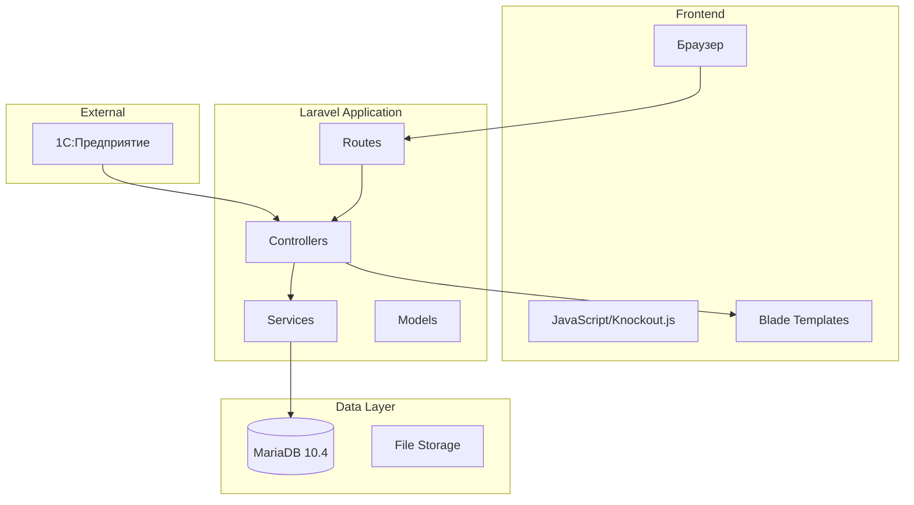
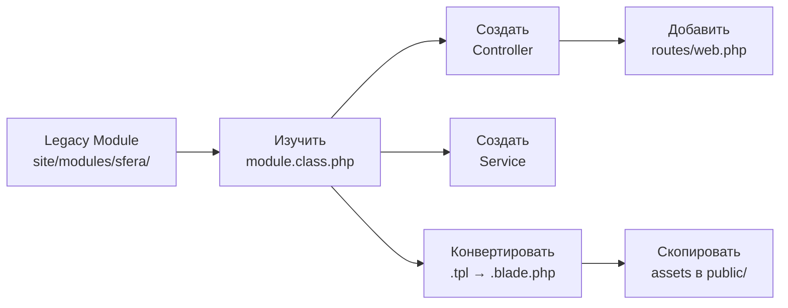
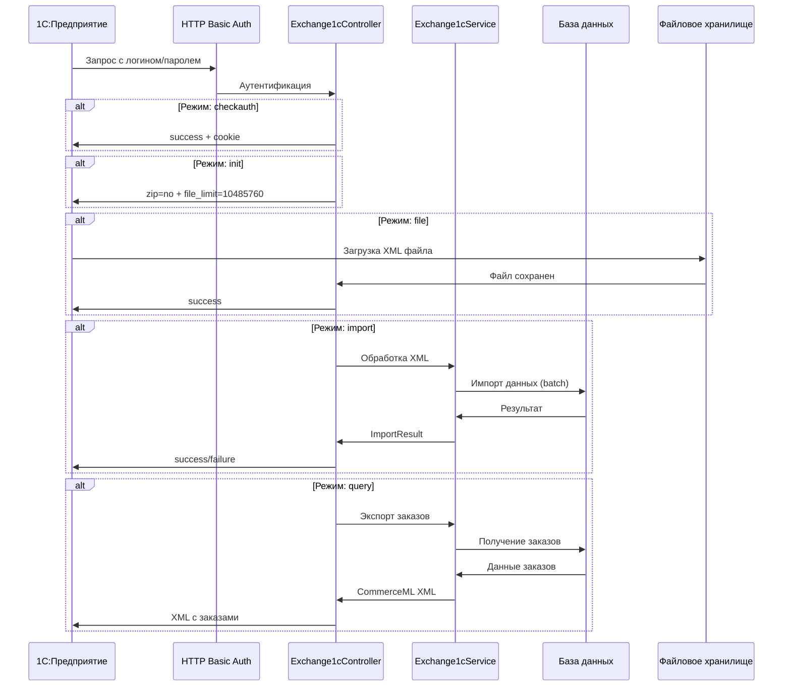
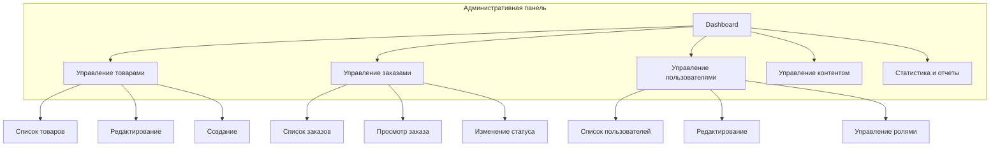

# Дизайн-документ: Миграция интернет-магазина "Сфера" с Legacy PHP на Laravel 12

## Обзор

Миграция интернет-магазина издательства "Сфера" с самописного PHP-движка (Smarty 2.6.11) на Laravel 12 с сохранением существующей базы данных и SQL-запросов.

**Текущее состояние:**
- Legacy: PHP 7.4, MariaDB 10.4, Smarty 2.6.11, модули в site/modules/sfera/
- Laravel: PHP 8.5 (строго), Blade, 66 моделей в app/Models/
- Реализовано: ProductController, CartController, CatalogController (частично), ProductService, CartService, FilterService (частично)

**Ключевой подход:**
- SQL-запросы сохраняются (DB::select, DB::selectOne) - НЕ переводим на Eloquent
- Верстка переносится максимально точно (Smarty → Blade)
- База данных используется как есть (таблицы: products, tree, prices, authors, attributes, o_reviews, o_images и др.)
- Сервисы для бизнес-логики (CartService, ProductService, FilterService)
- НЕТ legacy-адаптеров - переносим функционал заново на Laravel

## Архитектура

### Структура приложения



### Процесс миграции модуля



## Процесс миграции модуля

### 7 шагов миграции

**Шаг 1: Изучить legacy модуль**
- Открыть site/modules/sfera/{module}/
- Изучить {module}.class.php (метод execute(), SQL-запросы, логика)
- Изучить template.tpl (структура HTML, переменные Smarty)
- Изучить используемые assets (CSS, JS уже в public/assets/)

**Шаг 2: Создать Controller**
- Создать app/Http/Controllers/{Module}Controller.php
- Перенести логику из execute() в методы контроллера
- Сохранить SQL-запросы как есть (DB::select, DB::selectOne)
- Пример: ProductController::show() с прямыми SQL-запросами

**Шаг 3: Создать Service (если нужна сложная логика)**
- Создать app/Services/{Module}Service.php
- Вынести бизнес-логику из контроллера
- Методы работы с данными через SQL-запросы
- Пример: CartService::addItem(), ProductService::getProductRating()

**Шаг 4: Конвертировать шаблоны**
- Создать resources/views/{module}/ 
- Конвертировать .tpl → .blade.php
- Замены: ~~$var~ → {{ $var }}, ~~/if~ → @endif, ~~foreach~ → @foreach
- Сохранить структуру HTML/CSS максимально точно
- Пример: product/show.blade.php с точной версткой

**Шаг 5: Перенести SQL-запросы**
- Скопировать SQL-запросы из legacy как есть
- Обернуть в DB::select() или DB::selectOne()
- НЕ переводить на Eloquent ORM
- Это позволяет легко проверить запросы в DBForge
- Пример: CatalogController::getProducts() с прямыми SQL

**Шаг 6: Добавить роуты (если их нет)**
- Открыть routes/web.php
- ПРОВЕРИТЬ наличие маршрута перед добавлением (избегать дублей)
- Если роут уже существует - пропустить этап
- Следовать существующей структуре: /catalog, /product/{slug}, /cart
- Пример: Route::get('/product/{slug}', [ProductController::class, 'show'])

**Шаг 7: Проверить assets**
- Вся папка assets уже скопирована из legacy в public/
- НЕ копировать assets повторно
- Только обновить пути в шаблонах если нужно (asset() helper)
- Проверить работу на фронтенде

### Примеры реализации

**ProductController (страница товара):**
```php
public function show(Request $request, string $slug)
{
    // Получаем товар через SQL
    $product = DB::selectOne("
        SELECT p.*, pr.price 
        FROM products p
        LEFT JOIN prices pr ON p.id = pr.product_id 
        WHERE BINARY p.id = BINARY ?
    ", [$slug]);
    
    // Получаем атрибуты через SQL
    $attributes = DB::select("
        SELECT name, value 
        FROM attributes 
        WHERE product_id = ?
    ", [$product->id]);
    
    return view('product.show', compact('product', 'attributes'));
}
```

**CartService (корзина):**
```php
public function addItem(string $guid, int $amount = 1): array
{
    $cart = Session::get('cart', []);
    
    if (isset($cart[$guid])) {
        $cart[$guid] += $amount;
    } else {
        $cart[$guid] = $amount;
    }
    
    Session::put('cart', $cart);
    return $this->getCartData($cart);
}
```

**Blade шаблон (конвертация Smarty):**
```blade
{{-- Legacy: ~~$product.name~ --}}
<h1>{{ $product->name }}</h1>

{{-- Legacy: ~~if $product.price > 0~ --}}
@if($product->price > 0)
    <span class="price">{{ $product->price }} ₽</span>
@endif

{{-- Legacy: ~~foreach from=$attributes item=attr~ --}}
@foreach($attributes as $attr)
    <div>{{ $attr->name }}: {{ $attr->value }}</div>
@endforeach
```

## Ключевые компоненты

### 1. Exchange1cService - Обмен данными с 1С

**Назначение**: Интеграция с 1С:Предприятие по протоколу CommerceML 2.0

**Архитектура обмена:**



**Режимы обмена:**

1. **checkauth** - Проверка аутентификации
   - Проверяет HTTP Basic Auth логин/пароль
   - Возвращает: `success\n{session_id}\n{timestamp}`

2. **init** - Инициализация обмена
   - Возвращает параметры: `zip=no\nfile_limit=10485760`

3. **file** - Загрузка файлов
   - Принимает XML файлы (import.xml, offers.xml)
   - Сохраняет в `storage/app/1c/`
   - Возвращает: `success`

4. **import** - Импорт данных
   - Обрабатывает загруженные XML файлы
   - Импортирует товары, категории, цены, остатки
   - Возвращает: `success` или `failure\n{error_message}`

5. **query** - Экспорт заказов
   - Формирует CommerceML XML с новыми заказами
   - Возвращает XML документ

6. **success** - Подтверждение успешного импорта
   - Очищает временные файлы
   - Возвращает: `success`

**Методы Exchange1cService:**

```php
// Импорт каталога товаров из CommerceML
public function importCatalog(string $xmlPath): ImportResult
{
    $xml = simplexml_load_file($xmlPath);
    $imported = 0;
    $errors = [];
    
    // Импорт категорий
    foreach ($xml->Классификатор->Группы->Группа as $group) {
        $categoryId = (string)$group->Ид;
        $name = (string)$group->Наименование;
        
        DB::insert("
            INSERT INTO tree (id, name, parent_id) 
            VALUES (?, ?, NULL)
            ON DUPLICATE KEY UPDATE name = ?
        ", [$categoryId, $name, $name]);
    }
    
    // Импорт товаров (batch для производительности)
    $products = [];
    foreach ($xml->Каталог->Товары->Товар as $item) {
        $productId = (string)$item->Ид;
        $name = (string)$item->Наименование;
        $description = (string)$item->Описание;
        $categoryId = (string)$item->Группы->Ид;
        
        $products[] = [
            'id' => $productId,
            'name' => $name,
            'description' => $description,
            'category_id' => $categoryId
        ];
        
        // Batch insert каждые 100 товаров
        if (count($products) >= 100) {
            $this->batchInsertProducts($products);
            $imported += count($products);
            $products = [];
        }
    }
    
    // Вставка оставшихся товаров
    if (!empty($products)) {
        $this->batchInsertProducts($products);
        $imported += count($products);
    }
    
    return new ImportResult(true, "Импортировано товаров: {$imported}");
}

// Импорт предложений (цены и остатки)
public function importOffers(string $xmlPath): ImportResult
{
    $xml = simplexml_load_file($xmlPath);
    $imported = 0;
    
    foreach ($xml->ПакетПредложений->Предложения->Предложение as $offer) {
        $productId = (string)$offer->Ид;
        
        // Импорт цен
        foreach ($offer->Цены->Цена as $price) {
            $priceValue = (float)$price->ЦенаЗаЕдиницу;
            $priceTypeId = (string)$price->ИдТипаЦены;
            
            DB::insert("
                INSERT INTO prices (product_id, price_type_id, price) 
                VALUES (?, ?, ?)
                ON DUPLICATE KEY UPDATE price = ?
            ", [$productId, $priceTypeId, $priceValue, $priceValue]);
        }
        
        // Импорт остатков
        $quantity = (int)$offer->Количество;
        DB::update("
            UPDATE products 
            SET quantity = ? 
            WHERE id = ?
        ", [$quantity, $productId]);
        
        $imported++;
    }
    
    return new ImportResult(true, "Импортировано предложений: {$imported}");
}

// Экспорт заказов в 1С
public function exportOrders(): string
{
    // Получаем новые заказы (статус = 'new')
    $orders = DB::select("
        SELECT o.*, u.name as user_name, u.email, u.phone
        FROM orders o
        LEFT JOIN users u ON o.user_id = u.id
        WHERE o.exported_to_1c = 0
        ORDER BY o.created_at ASC
    ");
    
    // Формируем CommerceML XML
    $xml = new \SimpleXMLElement('<?xml version="1.0" encoding="UTF-8"?><КоммерческаяИнформация/>');
    $xml->addAttribute('ВерсияСхемы', '2.10');
    $xml->addAttribute('ДатаФормирования', date('Y-m-d\TH:i:s'));
    
    foreach ($orders as $order) {
        $orderXml = $xml->addChild('Документ');
        $orderXml->addChild('Ид', $order->id);
        $orderXml->addChild('Номер', $order->order_number);
        $orderXml->addChild('Дата', date('Y-m-d', strtotime($order->created_at)));
        $orderXml->addChild('Сумма', $order->total_amount);
        
        // Контрагент
        $contragent = $orderXml->addChild('Контрагент');
        $contragent->addChild('Наименование', $order->user_name);
        $contragent->addChild('Телефон', $order->phone);
        $contragent->addChild('Почта', $order->email);
        
        // Товары заказа
        $items = DB::select("
            SELECT oi.*, p.name
            FROM order_items oi
            LEFT JOIN products p ON oi.product_id = p.id
            WHERE oi.order_id = ?
        ", [$order->id]);
        
        $itemsXml = $orderXml->addChild('Товары');
        foreach ($items as $item) {
            $itemXml = $itemsXml->addChild('Товар');
            $itemXml->addChild('Ид', $item->product_id);
            $itemXml->addChild('Наименование', $item->name);
            $itemXml->addChild('Количество', $item->quantity);
            $itemXml->addChild('Цена', $item->price);
            $itemXml->addChild('Сумма', $item->price * $item->quantity);
        }
        
        // Помечаем заказ как экспортированный
        DB::update("
            UPDATE orders 
            SET exported_to_1c = 1, exported_at = NOW() 
            WHERE id = ?
        ", [$order->id]);
    }
    
    return $xml->asXML();
}

// Batch insert для производительности
private function batchInsertProducts(array $products): void
{
    $values = [];
    $bindings = [];
    
    foreach ($products as $product) {
        $values[] = "(?, ?, ?, ?)";
        $bindings[] = $product['id'];
        $bindings[] = $product['name'];
        $bindings[] = $product['description'];
        $bindings[] = $product['category_id'];
    }
    
    $sql = "
        INSERT INTO products (id, name, description, category_id) 
        VALUES " . implode(', ', $values) . "
        ON DUPLICATE KEY UPDATE 
            name = VALUES(name),
            description = VALUES(description),
            category_id = VALUES(category_id)
    ";
    
    DB::insert($sql, $bindings);
}
```

**Особенности реализации:**
- HTTP Basic Auth для безопасности
- Batch insert для производительности (100 товаров за раз)
- Логирование всех операций в `exchange1c_logs`
- Временное хранилище файлов в `storage/app/1c/`
- Поддержка CommerceML 2.0 формата
- Автоматическая очистка временных файлов после импорта

### 2. Модуль заказов пользователя

**Назначение**: Просмотр списка заказов, деталей заказа и генерация счетов на оплату

**Компоненты:**
- OrderController::index() - список заказов
- OrderController::show($id) - детали заказа
- OrderController::invoice($id) - счет на оплату

**Реализация:**

```php
// Список заказов пользователя
public function index(Request $request)
{
    $userId = Auth::id();
    
    // Получаем заказы пользователя
    $orders = DB::select("
        SELECT 
            o.id,
            o.order_number,
            o.created_at,
            o.status,
            o.total_amount,
            COUNT(oi.id) as items_count
        FROM orders o
        LEFT JOIN order_items oi ON o.id = oi.order_id
        WHERE o.user_id = ?
        GROUP BY o.id
        ORDER BY o.created_at DESC
    ", [$userId]);
    
    return view('orders.index', compact('orders'));
}

// Детали заказа
public function show(Request $request, int $id)
{
    $userId = Auth::id();
    
    // Получаем заказ с проверкой владельца
    $order = DB::selectOne("
        SELECT o.*, u.name as user_name, u.email, u.phone
        FROM orders o
        LEFT JOIN users u ON o.user_id = u.id
        WHERE o.id = ? AND o.user_id = ?
    ", [$id, $userId]);
    
    if (!$order) {
        abort(403, 'Доступ запрещен');
    }
    
    // Получаем товары заказа
    $items = DB::select("
        SELECT 
            oi.*,
            p.name,
            p.id as product_id
        FROM order_items oi
        LEFT JOIN products p ON oi.product_id = p.id
        WHERE oi.order_id = ?
    ", [$id]);
    
    return view('orders.show', compact('order', 'items'));
}

// Счет на оплату
public function invoice(Request $request, int $id)
{
    $userId = Auth::id();
    
    // Получаем заказ с проверкой владельца
    $order = DB::selectOne("
        SELECT o.*, u.name as user_name, u.email, u.phone, u.address
        FROM orders o
        LEFT JOIN users u ON o.user_id = u.id
        WHERE o.id = ? AND o.user_id = ?
    ", [$id, $userId]);
    
    if (!$order) {
        abort(403, 'Доступ запрещен');
    }
    
    // Получаем товары заказа
    $items = DB::select("
        SELECT 
            oi.*,
            p.name
        FROM order_items oi
        LEFT JOIN products p ON oi.product_id = p.id
        WHERE oi.order_id = ?
    ", [$id]);
    
    // Получаем реквизиты организации
    $company = DB::selectOne("
        SELECT * FROM company_details LIMIT 1
    ");
    
    return view('orders.invoice', compact('order', 'items', 'company'));
}
```

**Blade шаблоны:**

```blade
{{-- resources/views/orders/index.blade.php --}}
@extends('layouts.app')

@section('title', 'Мои заказы')

@section('content')
<div class="orders-page">
    <h1>Мои заказы</h1>
    
    @if(empty($orders))
        <p>У вас пока нет заказов</p>
    @else
        <div class="orders-list">
            @foreach($orders as $order)
                <div class="order-card">
                    <div class="order-header">
                        <span class="order-number">Заказ №{{ $order->order_number }}</span>
                        <span class="order-date">{{ date('d.m.Y', strtotime($order->created_at)) }}</span>
                    </div>
                    <div class="order-body">
                        <span class="order-status status-{{ $order->status }}">
                            {{ $order->status }}
                        </span>
                        <span class="order-items">Товаров: {{ $order->items_count }}</span>
                        <span class="order-total">{{ number_format($order->total_amount, 0, '', ' ') }} ₽</span>
                    </div>
                    <div class="order-actions">
                        <a href="{{ route('orders.show', $order->id) }}" class="btn btn-primary">
                            Подробнее
                        </a>
                        <a href="{{ route('orders.invoice', $order->id) }}" class="btn btn-secondary">
                            Счет на оплату
                        </a>
                    </div>
                </div>
            @endforeach
        </div>
    @endif
</div>
@endsection
```

### 3. Модуль добавления отзывов

**Назначение**: Позволяет пользователям оставлять отзывы на товары

**Компоненты:**
- ProductController::addReview() - обработка отзыва
- Форма на странице товара

**Реализация:**

```php
// Добавление отзыва
public function addReview(Request $request, string $slug)
{
    // Проверка аутентификации
    if (!Auth::check()) {
        return redirect()->route('login')
            ->with('message', 'Для добавления отзыва необходимо войти');
    }
    
    // Валидация
    $validated = $request->validate([
        'rating' => 'required|integer|min:1|max:5',
        'text' => 'required|string|min:10|max:1000',
    ]);
    
    $userId = Auth::id();
    
    // Получаем товар
    $product = DB::selectOne("
        SELECT p.*, vpo.sku
        FROM products p
        LEFT JOIN v_products_o_products vpo ON p.id = vpo.offer_id
        WHERE BINARY p.id = BINARY ?
    ", [$slug]);
    
    if (!$product) {
        abort(404);
    }
    
    // Проверяем, не оставлял ли пользователь уже отзыв
    $existingReview = DB::selectOne("
        SELECT id FROM o_reviews
        WHERE sku = ? AND user_id = ?
    ", [$product->sku, $userId]);
    
    if ($existingReview) {
        // Обновляем существующий отзыв
        DB::update("
            UPDATE o_reviews
            SET rating = ?, text = ?, updated_at = NOW()
            WHERE id = ?
        ", [$validated['rating'], $validated['text'], $existingReview->id]);
        
        $message = 'Ваш отзыв обновлен';
    } else {
        // Создаем новый отзыв
        DB::insert("
            INSERT INTO o_reviews (sku, user_id, rating, text, created_at)
            VALUES (?, ?, ?, ?, NOW())
        ", [$product->sku, $userId, $validated['rating'], $validated['text']]);
        
        $message = 'Спасибо за ваш отзыв!';
    }
    
    return redirect()->route('product.show', $slug)
        ->with('success', $message);
}
```

**Форма отзыва (добавляется на страницу товара):**

```blade
{{-- resources/views/product/partials/review-form.blade.php --}}
<div class="review-form-section">
    <h3>Оставить отзыв</h3>
    
    @auth
        <form action="{{ route('product.addReview', $product->id) }}" method="POST" class="review-form">
            @csrf
            
            <div class="form-group">
                <label>Ваша оценка:</label>
                <div class="rating-input">
                    @for($i = 5; $i >= 1; $i--)
                        <input type="radio" name="rating" value="{{ $i }}" id="rating-{{ $i }}" required>
                        <label for="rating-{{ $i }}">★</label>
                    @endfor
                </div>
                @error('rating')
                    <span class="error">{{ $message }}</span>
                @enderror
            </div>
            
            <div class="form-group">
                <label for="review-text">Ваш отзыв:</label>
                <textarea 
                    name="text" 
                    id="review-text" 
                    rows="5" 
                    placeholder="Расскажите о вашем опыте использования товара..."
                    required
                    minlength="10"
                    maxlength="1000"
                >{{ old('text') }}</textarea>
                @error('text')
                    <span class="error">{{ $message }}</span>
                @enderror
            </div>
            
            <button type="submit" class="btn btn-primary">Отправить отзыв</button>
        </form>
    @else
        <p>
            <a href="{{ route('login') }}">Войдите</a>, чтобы оставить отзыв
        </p>
    @endauth
</div>
```

### 4. Административная панель

**Назначение**: Управление интернет-магазином (товары, заказы, пользователи, контент, статистика)

**Архитектура:**



**Варианты реализации:**

#### Вариант 1: Готовые решения (Рекомендуется)

**Laravel Nova** (платная, $99/проект)
- Официальная админ-панель от создателей Laravel
- Красивый современный интерфейс
- Мощные фильтры и поиск
- Поддержка отношений между моделями
- Метрики и дашборды
- Лицензия: $99 за проект

**Filament** (бесплатная, рекомендуется)
- Современная бесплатная админ-панель
- Построена на Livewire и Tailwind CSS
- Богатый функционал из коробки
- Активное сообщество
- Хорошая документация
- Лицензия: MIT (бесплатно)

**Voyager** (бесплатная)
- Простая в использовании
- BREAD (Browse, Read, Edit, Add, Delete) генератор
- Медиа-менеджер
- Меню-билдер
- Лицензия: MIT (бесплатно)

**Backpack** (freemium)
- Бесплатная базовая версия
- Платные дополнения
- Гибкая настройка
- Хорошая документация
- Лицензия: MIT + платные дополнения

**Сравнение:**

| Критерий | Nova | Filament | Voyager | Backpack |
|----------|------|----------|---------|----------|
| Цена | $99 | Бесплатно | Бесплатно | Freemium |
| Интерфейс | ⭐⭐⭐⭐⭐ | ⭐⭐⭐⭐⭐ | ⭐⭐⭐ | ⭐⭐⭐⭐ |
| Функционал | ⭐⭐⭐⭐⭐ | ⭐⭐⭐⭐ | ⭐⭐⭐ | ⭐⭐⭐⭐ |
| Документация | ⭐⭐⭐⭐⭐ | ⭐⭐⭐⭐ | ⭐⭐⭐ | ⭐⭐⭐⭐ |
| Сообщество | ⭐⭐⭐⭐ | ⭐⭐⭐⭐⭐ | ⭐⭐⭐ | ⭐⭐⭐⭐ |
| Кастомизация | ⭐⭐⭐⭐ | ⭐⭐⭐⭐⭐ | ⭐⭐⭐ | ⭐⭐⭐⭐ |

**Рекомендация:** Filament - лучший выбор для данного проекта:
- Бесплатный
- Современный интерфейс
- Легко интегрируется с существующими моделями
- Поддерживает прямые SQL-запросы через Eloquent
- Активное развитие

#### Вариант 2: Миграция legacy админки

Если требуется сохранить существующую логику админки:

**Структура:**
```
app/Http/Controllers/Admin/
├── DashboardController.php
├── ProductController.php
├── OrderController.php
├── UserController.php
├── ContentController.php
└── StatsController.php

resources/views/admin/
├── layout.blade.php
├── dashboard.blade.php
├── products/
├── orders/
├── users/
├── content/
└── stats/
```

**Middleware для защиты:**
```php
// app/Http/Middleware/AdminMiddleware.php
public function handle($request, Closure $next)
{
    if (!Auth::check() || !Auth::user()->is_admin) {
        abort(403, 'Доступ запрещен');
    }
    
    return $next($request);
}
```

**Роуты:**
```php
// routes/web.php
Route::prefix('admin')->middleware(['auth', 'admin'])->group(function () {
    Route::get('/', [Admin\DashboardController::class, 'index'])->name('admin.dashboard');
    Route::resource('products', Admin\ProductController::class);
    Route::resource('orders', Admin\OrderController::class);
    Route::resource('users', Admin\UserController::class);
    Route::resource('content', Admin\ContentController::class);
    Route::get('stats', [Admin\StatsController::class, 'index'])->name('admin.stats');
});
```

**Преимущества миграции legacy:**
- Полный контроль над функционалом
- Сохранение привычного интерфейса
- Возможность точной настройки

**Недостатки:**
- Требует больше времени на разработку
- Нужно поддерживать код самостоятельно
- Меньше готовых компонентов

**Рекомендация по выбору:**
- Если бюджет позволяет и нужен премиум-функционал → Laravel Nova
- Если нужно бесплатное современное решение → Filament (рекомендуется)
- Если нужна простота и скорость → Voyager
- Если нужна гибкость с возможностью расширения → Backpack
- Если критична совместимость с legacy → Миграция вручную

## Модели данных

Используются существующие 66 моделей в app/Models/. Основные таблицы:

**products** - товары (id, name, description, category_id, quantity)
**tree** - категории (id, name, parent_id, sort, status)
**prices** - цены (product_id, price_type_id, price)
**authors** - авторы (product_id, author_name)
**attributes** - характеристики (product_id, name, value)
**o_reviews** - отзывы (sku, rating, text, date)
**o_images** - изображения (product_id, image_order)
**v_products_o_products** - связь товаров с Ozon (offer_id, product_id, sku)
**orders** - заказы (user_id, status, total_amount)
**users** - пользователи (name, email, phone, password)

Модели используются ТОЛЬКО для определения структуры. Запросы выполняются через DB::select().

## Обработка ошибок

**404 - Страница не найдена**
- Логирование в log_404
- Отображение страницы errors/404.blade.php
- Fallback route в routes/web.php

**500 - Ошибка сервера**
- Логирование в Laravel log
- Отображение страницы errors/500.blade.php
- Email уведомление администратору

**Ошибки обмена с 1С**
- XML-ответ с описанием ошибки
- Логирование в exchange1c_logs
- Повторная попытка через очередь

**Ошибки корзины**
- JSON-ответ с полем error
- Обновление состояния корзины
- Уведомление пользователя через UI

## Тестирование

**Юнит-тесты (PHPUnit):**
- CartService, ProductService, FilterService
- Методы работы с данными
- Валидация входных параметров

**КРИТИЧЕСКИ ВАЖНО для тестов:**
- Работаем с РАБОЧЕЙ базой данных
- НЕ удалять и НЕ очищать таблицы полностью
- Использовать Database Transactions для отката изменений
- Создавать тестовые записи с уникальными ID (например, test_product_xxx)
- После теста откатывать транзакцию или удалять только тестовые записи
- НЕ использовать RefreshDatabase trait

**Пример безопасного теста:**
```php
public function test_add_item_to_cart()
{
    DB::beginTransaction();
    
    try {
        // Создаем тестовый товар
        DB::insert("INSERT INTO products (id, name) VALUES (?, ?)", 
            ['test_product_123', 'Test Product']);
        
        // Тестируем функционал
        $result = $this->cartService->addItem('test_product_123', 1);
        $this->assertArrayHasKey('items', $result);
        
        // Откатываем изменения
        DB::rollBack();
    } catch (\Exception $e) {
        DB::rollBack();
        throw $e;
    }
}
```

**Интеграционные тесты:**
- HTTP-тесты маршрутов (Feature tests)
- Тестирование AJAX-endpoints
- Рендеринг Blade-шаблонов
- Также использовать транзакции для безопасности

**Ручное тестирование:**
- Проверка верстки на разных устройствах
- Тестирование UX и адаптивности
- Сравнение с legacy версией

## Зависимости

**Laravel 12** - основной фреймворк
**MariaDB 10.4** - база данных (используется как есть)
**PHP 8.5** - язык программирования (строго)
**Blade** - шаблонизатор (замена Smarty)
**Knockout.js** - фронтенд (сохраняется из legacy)
**1С:Предприятие** - обмен данными (CommerceML)

## План переноса функционала

Функционал переносится в логическом порядке разработки интернет-магазина с нуля, учитывая зависимости между модулями.

### ✅ Этап 1: Базовый каталог (ЗАВЕРШЕН)
**Модули:** catalog (базовый), product (базовый)
**Цель:** Пользователь может видеть список товаров
**Реализовано:**
- CatalogController::index() - список товаров
- Базовая структура каталога
- Роуты: /catalog, /catalog/{category_id}

### ✅ Этап 2: Корзина (ЗАВЕРШЕН)
**Модули:** cart, ajax (частично)
**Цель:** Пользователь может добавлять товары в корзину
**Реализовано:**
- CartController - отображение корзины
- CartService - логика работы с корзиной
- AJAX API для корзины (add, remove, update)
- Роуты: /cart, /api/cart

### ✅ Этап 3: Карточки товаров в каталоге (ЗАВЕРШЕН)
**Модули:** catalog (улучшение)
**Цель:** Полноценные карточки товаров с изображениями, ценами, рейтингом
**Реализовано:**
- ProductService::getProductRating()
- ProductService::getProductImageUrl()
- Отображение карточек в каталоге

### ✅ Этап 4: Страница товара (ЗАВЕРШЕН)
**Модули:** product, item
**Цель:** Детальная информация о товаре
**Реализовано:**
- ProductController::show()
- ProductService (методы для атрибутов, изображений, отзывов)
- Breadcrumbs, SEO метаданные
- Роут: /product/{slug}

### ✅ Этап 5: Фильтры каталога (ЗАВЕРШЕН)
**Модули:** filter, catalog (доработка)
**Цель:** Фильтрация товаров по авторам, возрастам, сериям, типам, тематикам
**Зависимости:** Каталог, карточки товаров
**Реализовано:**
- FilterService - полная реализация
- Фильтры по авторам
- Фильтры по возрастам
- Фильтры по сериям
- Фильтры по типам товаров
- Фильтры по тематикам
- AJAX обновление каталога при изменении фильтров

### ✅ Этап 6: Авторы и связанные страницы (ЗАВЕРШЕН)
**Модули:** authors, author
**Цель:** Страницы авторов и их книг
**Зависимости:** Каталог, фильтры
**Реализовано:**
- AuthorController::index() - список всех авторов
- AuthorController::show() - страница автора с его книгами
- Роуты: /authors, /author/{slug}

### ✅ Этап 7: Серии, тематики, типы товаров (ЗАВЕРШЕН)
**Модули:** series, seriya, topics, topic, product_types, product_type
**Цель:** Страницы серий, тематик, типов товаров
**Зависимости:** Каталог, фильтры
**Реализовано:**
- SeriesController - список серий и страница серии
- TopicController - список тематик и страница тематики
- ProductTypeController - список типов товаров и страница типа
- Роуты: /series, /seriya/{slug}, /topics, /topic/{slug}, /product_types, /product_type/{slug}

### ✅ Этап 8: Избранное (ЗАВЕРШЕН)
**Модули:** favorites
**Цель:** Пользователь может добавлять товары в избранное
**Зависимости:** Каталог, страница товара
**Реализовано:**
- FavoriteService - полная реализация
- FavoriteController - управление избранным
- AJAX API для избранного
- Страница избранного (/favorites)
- Счетчик избранного в header
- Синхронизация состояния на всех карточках товаров

### ✅ Этап 9: Поиск (ЗАВЕРШЕН)
**Модули:** search
**Цель:** Поиск товаров по названию, автору, описанию
**Зависимости:** Каталог
**Реализовано:**
- SearchController::index() - страница результатов поиска
- SearchController::autocomplete() - автодополнение поиска
- AJAX автодополнение в header
- Роуты: /search, /api/search/autocomplete

### ✅ Этап 10: Авторизация и регистрация (ЗАВЕРШЕН)
**Модули:** auth, login, register
**Цель:** Пользователь может зарегистрироваться и войти
**Зависимости:** Нет (базовый функционал)
**Реализовано:**
- AuthController::login() - форма входа
- AuthController::authenticate() - обработка входа
- AuthController::register() - форма регистрации
- AuthController::store() - обработка регистрации
- AuthController::logout() - выход
- Роуты: /login, /register, /logout

### ✅ Этап 11: Профиль пользователя (ЗАВЕРШЕН)
**Модули:** profile
**Цель:** Пользователь может управлять своими данными
**Зависимости:** Авторизация
**Реализовано:**
- ProfileController::index() - страница профиля
- ProfileController::update() - обновление данных
- Редактирование данных пользователя
- История заказов (ссылка на /orders)
- Изменение пароля
- Роут: /profile

### ✅ Этап 12: Оформление заказа (ЗАВЕРШЕН)
**Модули:** checkout, _order
**Цель:** Пользователь может оформить заказ
**Зависимости:** Корзина, авторизация
**Реализовано:**
- OrderController::checkout() - форма оформления
- OrderController::placeOrder() - создание заказа
- Валидация данных доставки
- Создание заказа в БД
- Обработка только выбранных товаров из корзины
- Knockout.js ViewModel для управления состоянием
- Роут: /checkout

### ✅ Этап 13: Страница благодарности (ЗАВЕРШЕН)
**Модули:** thankyoupage
**Цель:** Подтверждение успешного заказа
**Зависимости:** Оформление заказа
**Реализовано:**
- OrderController::thankyoupage() - страница благодарности
- Отображение деталей заказа
- Роут: /thankyoupage

### 🔴 Этап 14: Заказы пользователя (КРИТИЧНО!)
**Модули:** orders, order, invoice
**Цель:** Пользователь может видеть свои заказы и скачивать счета
**Зависимости:** Профиль, оформление заказа
**Приоритет:** КРИТИЧНЫЙ - базовый функционал интернет-магазина
**Что нужно:**
- OrderController::index() - список заказов пользователя
- OrderController::show($id) - детали заказа
- OrderController::invoice($id) - счет на оплату (PDF/HTML)
- Роуты: /orders, /order/{id}, /invoice/{id}
- Проверка прав доступа (пользователь может видеть только свои заказы)
**Статус:** Есть заглушки в OrderController, требуется полная реализация

### 🟡 Этап 15: Добавление отзывов на товары (ВАЖНО)
**Модули:** product_reviews
**Цель:** Пользователь может оставлять отзывы на товары
**Зависимости:** Страница товара, авторизация
**Приоритет:** ВАЖНЫЙ - влияет на доверие и конверсию
**Что нужно:**
- ProductController::addReview() - обработка отзыва
- Форма добавления отзыва на странице товара
- Валидация отзывов (рейтинг 1-5, текст минимум 10 символов)
- Проверка дублирования (один отзыв от пользователя на товар)
- Обновление среднего рейтинга товара
**Статус:** Отзывы отображаются, но нельзя добавить новый

### ✅ Этап 16: Главная страница (ЗАВЕРШЕН)
**Модули:** showcase, main_carousel, promo_carousel, top10_products, random_products, popular_categories, banners, product_reviews
**Цель:** Привлекательная главная страница с актуальными предложениями
**Зависимости:** Каталог, товары
**Реализовано:**
- ShowcaseController::index() - главная страница
- Blade компоненты для всех модулей
- Карусели товаров (главная, промо, топ-10, случайные)
- Популярные категории
- Баннеры
- Отзывы на главной
- Роут: /

### 🟡 Этап 17: Меню и навигация (ВАЖНО)
**Модули:** menu, catalog_menu, secondary_nav, breadcrumbs
**Цель:** Удобная навигация по сайту
**Зависимости:** Каталог, категории
**Приоритет:** ВАЖНЫЙ - улучшает UX
**Что нужно:**
- MenuService - генерация структуры меню из БД
- Динамическое меню категорий в header
- Кеширование меню (1 час)
- BreadcrumbsService - генерация breadcrumbs
- Breadcrumbs на всех страницах (кроме главной)
- Микроразметка Schema.org для SEO
**Статус:** Breadcrumbs частично есть на странице товара, меню статичное

### ✅ Этап 18: Статические страницы (ЗАВЕРШЕН)
**Модули:** page, page_builder, section
**Цель:** Информационные страницы (О нас, Контакты, Доставка и т.д.)
**Зависимости:** Нет
**Реализовано:**
- PageController::show() - отображение страницы из БД
- Система контентных блоков с shortcode [section guid="..."]
- ShortcodeParser - обработка shortcode
- SectionRepository - работа с page_sections
- Автоматическая изоляция CSS/JS блоков
- Команда php artisan sections:wrap-css
- Роут: /{slug}

### 📋 Этап 19: Хештеги товаров (НИЗКИЙ ПРИОРИТЕТ)
**Модули:** product_hashtags, hashtag_products
**Цель:** Группировка товаров по хештегам
**Зависимости:** Каталог, товары
**Приоритет:** НИЗКИЙ
**Что нужно:**
- Страница хештега (/hashtag/{slug})
- Отображение хештегов на карточках товаров
**Статус:** Не реализовано

### 🔴 Этап 20: Обмен с 1С (КРИТИЧНО!)
**Модули:** exchange1c
**Цель:** Синхронизация товаров, цен, остатков, заказов с 1С:Предприятие
**Зависимости:** Товары, заказы
**Приоритет:** КРИТИЧНЫЙ - без этого нет синхронизации данных
**Что нужно:**
- Exchange1cController - обработка запросов от 1С
- Exchange1cService - бизнес-логика обмена
- Импорт каталога (CommerceML XML) - товары и категории
- Импорт предложений (CommerceML XML) - цены и остатки
- Экспорт заказов (CommerceML XML) - передача заказов в 1С
- HTTP Basic Auth для аутентификации
- Режимы: checkauth, init, file, import, query, success
- Batch insert для производительности
- Логирование всех операций
- Роут: /exchange1c
**Статус:** Есть заглушка в Exchange1cController, требуется полная реализация

### 📋 Этап 21: Импорт данных (СРЕДНИЙ ПРИОРИТЕТ)
**Модули:** import
**Цель:** Импорт товаров из внешних источников (CSV, XML)
**Зависимости:** Товары
**Приоритет:** СРЕДНИЙ
**Что нужно:**
- Импорт из CSV/XML
- Импорт изображений
- Логирование импорта
**Статус:** Не реализовано

### 🔴 Этап 22: Административная панель (КРИТИЧНО!)
**Модули:** admin (все подмодули)
**Цель:** Управление интернет-магазином
**Зависимости:** Все модули
**Приоритет:** КРИТИЧНЫЙ - без админки невозможно управлять сайтом
**Что нужно:**

#### Вариант A: Готовое решение (Рекомендуется)
- **Filament** (бесплатно, рекомендуется) - современная админ-панель
- **Laravel Nova** ($99) - официальная премиум админ-панель
- **Voyager** (бесплатно) - простая админ-панель
- **Backpack** (freemium) - гибкая админ-панель

#### Вариант B: Миграция legacy админки
- Управление товарами (добавление, редактирование, удаление)
- Управление заказами (просмотр, изменение статусов, печать)
- Управление пользователями (список, редактирование, роли)
- Управление контентом (страницы, баннеры, карусели)
- Статистика и отчеты (продажи, товары, аналитика)

**Рекомендация:** Filament - бесплатный, современный, легко интегрируется
**Статус:** Не реализовано (0%)

### 📋 Этап 23: Дополнительный функционал (НИЗКИЙ ПРИОРИТЕТ)
**Модули:** group_buy (совместные покупки), sms (SMS уведомления), product_carousel (дополнительные карусели)
**Цель:** Расширенные возможности магазина
**Зависимости:** Различные
**Приоритет:** НИЗКИЙ
**Статус:** Не реализовано

### Принципы приоритизации

1. **Зависимости** - сначала базовый функционал, потом зависимый
2. **Ценность для пользователя** - функционал, который видит пользователь
3. **Частота использования** - часто используемые модули в приоритете
4. **Сложность** - простые модули раньше сложных (при равной ценности)
5. **Критичность** - функционал, без которого магазин не может работать

### Текущий статус миграции

**Реализовано (Frontend):**
- ✅ Этапы 1-13, 16, 18: ~70% функционала
- ✅ Модулей: 25+
- ✅ Контроллеров: 12
- ✅ Сервисов: 5
- ✅ Blade шаблонов: 30+

**Критичные задачи (требуют немедленной реализации):**
- 🔴 Этап 14: Заказы пользователя (список, детали, счета)
- 🔴 Этап 20: Обмен с 1С (импорт/экспорт данных)
- 🔴 Этап 22: Административная панель (управление сайтом)

**Важные задачи (улучшают UX):**
- 🟡 Этап 15: Добавление отзывов
- 🟡 Этап 17: Динамическое меню и breadcrumbs

**Общий процент готовности:** ~40-50%
- Frontend: ~70% (без админки)
- Backend: ~40% (нет обмена с 1С)
- Admin: 0% (не реализовано)

### Следующие шаги (по приоритету)

1. **Реализовать заказы пользователя** (Этап 14)
   - Список заказов
   - Детали заказа
   - Счет на оплату

2. **Выбрать и внедрить админ-панель** (Этап 22)
   - Рекомендация: Filament (бесплатно, современно)
   - Альтернатива: Laravel Nova (платно, премиум)
   - Или: Миграция legacy админки

3. **Реализовать обмен с 1С** (Этап 20)
   - Exchange1cService
   - Импорт каталога
   - Импорт предложений
   - Экспорт заказов

4. **Добавить возможность оставлять отзывы** (Этап 15)
   - Форма на странице товара
   - Валидация и сохранение

5. **Улучшить навигацию** (Этап 17)
   - Динамическое меню
   - Полноценные breadcrumbs

### Рекомендации по дальнейшей разработке

**Для административной панели:**
- Использовать Filament - бесплатный, современный, легко интегрируется
- Преимущества: готовые компоненты, CRUD из коробки, активное сообщество
- Установка: `composer require filament/filament`
- Документация: https://filamentphp.com/docs

**Для обмена с 1С:**
- Следовать протоколу CommerceML 2.0
- Использовать batch операции для производительности
- Логировать все операции обмена
- Тестировать на реальных данных из 1С

**Для заказов пользователя:**
- Строгая проверка прав доступа (пользователь видит только свои заказы)
- Генерация счетов в PDF (использовать dompdf или snappy)
- Отображение истории статусов заказа

**Для отзывов:**
- Один отзыв от пользователя на товар
- Возможность редактирования своего отзыва
- Модерация отзывов (опционально)
- Автоматический пересчет среднего рейтинга
