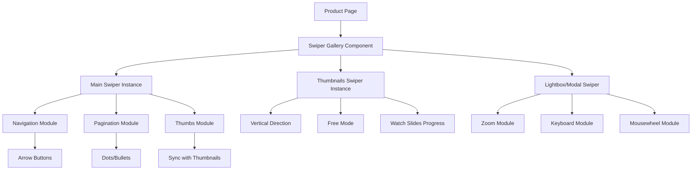
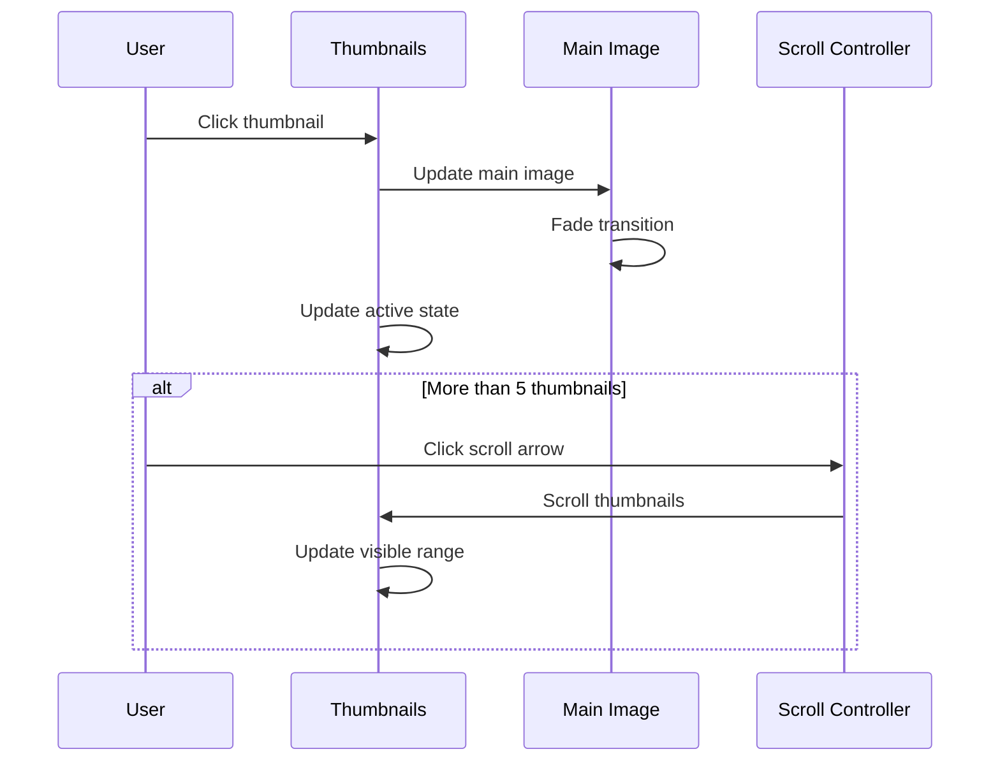
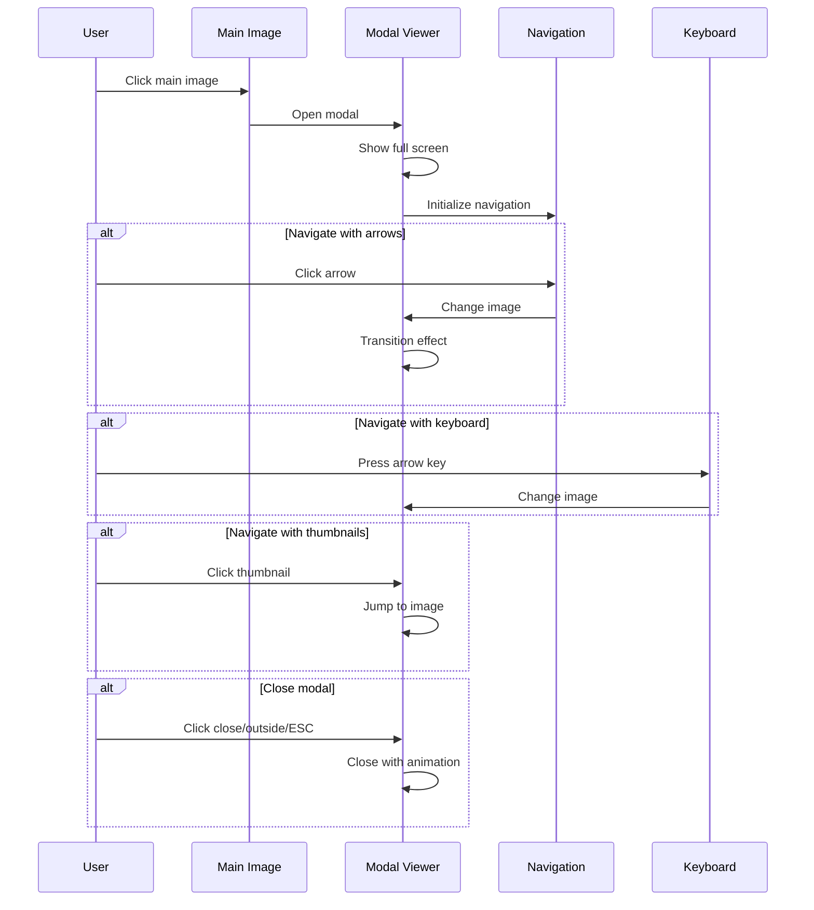

# Design Document: Product Page Gallery Enhancement

## Overview

Улучшение галереи изображений на странице товара с добавлением вертикальной прокрутки миниатюр и модального просмотра в полноэкранном режиме. Реализация будет следовать паттернам популярных маркетплейсов (Ozon, Wildberries) с использованием чистого JavaScript без дополнительных библиотек.

Текущая реализация имеет базовую структуру с вертикальными миниатюрами слева и основным изображением справа, но не поддерживает прокрутку при большом количестве изображений и не имеет модального просмотра.

## Architecture



## Sequence Diagrams

### Main Flow: Thumbnail Navigation



### Modal Flow: Full Screen Viewing



## Components and Interfaces

### Component 1: ProductGallery (Main Controller)

**Purpose**: Инициализация и координация двух Swiper инстансов (основной и миниатюры)

**Interface**:
```javascript
class ProductGallery {
  constructor(containerElement, options)
  init()
  initMainSwiper()
  initThumbsSwiper()
  openLightbox(index)
  destroy()
}
```

**Swiper Configuration**:
```javascript
// Main Swiper
{
  modules: [Navigation, Pagination, Thumbs],
  spaceBetween: 10,
  navigation: {
    nextEl: '.swiper-button-next',
    prevEl: '.swiper-button-prev',
  },
  thumbs: {
    swiper: thumbsSwiper // Связь с миниатюрами
  }
}

// Thumbs Swiper
{
  modules: [FreeMode, Thumbs],
  direction: 'vertical',
  spaceBetween: 10,
  slidesPerView: 5,
  freeMode: true,
  watchSlidesProgress: true
}
```

**Responsibilities**:
- Инициализация основного Swiper для главного изображения
- Инициализация Swiper для вертикальных миниатюр
- Связывание двух инстансов через thumbs модуль
- Обработка открытия lightbox/модального окна

### Component 2: LightboxGallery

**Purpose**: Полноэкранный просмотр с навигацией и zoom

**Interface**:
```javascript
class LightboxGallery {
  constructor(images, startIndex = 0)
  open(index)
  close()
  initLightboxSwiper()
  destroy()
}
```

**Swiper Configuration**:
```javascript
{
  modules: [Navigation, Pagination, Zoom, Keyboard],
  zoom: {
    maxRatio: 3,
    minRatio: 1
  },
  keyboard: {
    enabled: true,
    onlyInViewport: false
  },
  navigation: {
    nextEl: '.lightbox-button-next',
    prevEl: '.lightbox-button-prev',
  },
  pagination: {
    el: '.lightbox-pagination',
    type: 'fraction'
  },
  loop: true
}
```

**Responsibilities**:
- Создание модального окна с Swiper
- Поддержка zoom (pinch-to-zoom на мобильных)
- Клавиатурная навигация
- Закрытие по ESC, клику вне изображения

## Data Models

### ImageData

```javascript
interface ImageData {
  url: string           // URL изображения
  alt: string          // Альтернативный текст
  index: number        // Индекс в массиве
}
```

**Validation Rules**:
- url должен быть непустой строкой
- alt может быть пустым, но должен быть строкой
- index должен быть неотрицательным целым числом

### GalleryOptions

```javascript
interface GalleryOptions {
  visibleThumbnails: number    // Количество видимых миниатюр (default: 5)
  scrollStep: number           // Шаг прокрутки (default: 1)
  transitionDuration: number   // Длительность анимации в мс (default: 300)
  enableKeyboard: boolean      // Включить клавиатурную навигацию (default: true)
  enableTouch: boolean         // Включить свайп-навигацию (default: true)
  enableModal: boolean         // Включить модальный просмотр (default: true)
}
```

**Validation Rules**:
- visibleThumbnails должен быть > 0
- scrollStep должен быть > 0
- transitionDuration должен быть >= 0
- Булевы флаги должны быть boolean типа

### ModalState

```javascript
interface ModalState {
  isOpen: boolean              // Открыто ли модальное окно
  currentIndex: number         // Текущий индекс изображения
  images: ImageData[]          // Массив изображений
  touchStartX: number | null   // Начальная позиция касания
  touchStartY: number | null   // Начальная позиция касания по Y
}
```

## Algorithmic Pseudocode

### Main Initialization Algorithm

```pascal
ALGORITHM initializeGallery(galleryElement)
INPUT: galleryElement (DOM element)
OUTPUT: GalleryController instance

BEGIN
  ASSERT galleryElement IS NOT NULL
  
  // Step 1: Extract image data from DOM
  images ← extractImagesFromDOM(galleryElement)
  ASSERT images.length > 0
  
  // Step 2: Initialize thumbnail carousel
  thumbnailContainer ← galleryElement.querySelector('.gallery-thumbnails-vertical')
  thumbnailCarousel ← NEW ThumbnailCarousel(thumbnailContainer, images)
  thumbnailCarousel.init()
  
  // Step 3: Initialize main image display
  mainImageContainer ← galleryElement.querySelector('.gallery-main')
  mainImageDisplay ← NEW MainImageDisplay(mainImageContainer, images)
  mainImageDisplay.setImage(0, false)
  
  // Step 4: Setup event handlers
  FOR each thumbnail IN thumbnailCarousel.thumbnails DO
    thumbnail.addEventListener('click', handleThumbnailClick)
  END FOR
  
  mainImageContainer.addEventListener('click', handleMainImageClick)
  
  // Step 5: Initialize modal viewer (lazy)
  modalViewer ← NULL
  
  RETURN NEW GalleryController(thumbnailCarousel, mainImageDisplay, modalViewer)
END
```

**Preconditions:**
- galleryElement существует в DOM
- galleryElement содержит необходимую структуру (.gallery-thumbnails-vertical, .gallery-main)
- В DOM присутствует хотя бы одно изображение

**Postconditions:**
- Все компоненты инициализированы
- Event listeners установлены
- Первое изображение отображается
- Галерея готова к взаимодействию

### Thumbnail Scroll Algorithm

```pascal
ALGORITHM scrollThumbnails(direction, scrollStep)
INPUT: direction ('up' or 'down'), scrollStep (integer)
OUTPUT: Updated scroll position

BEGIN
  ASSERT direction IN ['up', 'down']
  ASSERT scrollStep > 0
  
  container ← thumbnailContainer
  currentScroll ← container.scrollTop
  thumbnailHeight ← getThumbnailHeight()
  
  IF direction = 'up' THEN
    newScroll ← MAX(0, currentScroll - (thumbnailHeight * scrollStep))
  ELSE
    maxScroll ← container.scrollHeight - container.clientHeight
    newScroll ← MIN(maxScroll, currentScroll + (thumbnailHeight * scrollStep))
  END IF
  
  // Smooth scroll animation
  animateScroll(container, currentScroll, newScroll, 300)
  
  // Update button states
  updateScrollButtons(newScroll, maxScroll)
  
  RETURN newScroll
END
```

**Preconditions:**
- Контейнер миниатюр существует
- scrollStep является положительным числом
- direction имеет допустимое значение

**Postconditions:**
- Контейнер прокручен на нужное расстояние
- Кнопки прокрутки обновлены (disabled/enabled)
- Анимация прокрутки завершена

**Loop Invariants:**
- newScroll всегда находится в допустимом диапазоне [0, maxScroll]

### Modal Navigation Algorithm

```pascal
ALGORITHM navigateModal(direction)
INPUT: direction ('next' or 'prev')
OUTPUT: Updated modal state

BEGIN
  ASSERT modalState.isOpen = TRUE
  ASSERT direction IN ['next', 'prev']
  
  currentIndex ← modalState.currentIndex
  totalImages ← modalState.images.length
  
  IF direction = 'next' THEN
    newIndex ← (currentIndex + 1) MOD totalImages
  ELSE
    newIndex ← (currentIndex - 1 + totalImages) MOD totalImages
  END IF
  
  // Preload adjacent images
  preloadImage(modalState.images[newIndex].url)
  nextIndex ← (newIndex + 1) MOD totalImages
  preloadImage(modalState.images[nextIndex].url)
  
  // Update display with transition
  oldImage ← modalImageElement
  newImage ← createImageElement(modalState.images[newIndex])
  
  // Slide transition
  IF direction = 'next' THEN
    animateSlide(oldImage, 'left', newImage, 'right')
  ELSE
    animateSlide(oldImage, 'right', newImage, 'left')
  END IF
  
  // Update state
  modalState.currentIndex ← newIndex
  updateModalThumbnails(newIndex)
  
  RETURN modalState
END
```

**Preconditions:**
- Модальное окно открыто (modalState.isOpen = true)
- currentIndex находится в допустимом диапазоне
- Массив изображений не пуст

**Postconditions:**
- Отображается новое изображение
- currentIndex обновлен
- Соседние изображения предзагружены
- Миниатюры в модальном окне обновлены

**Loop Invariants:**
- newIndex всегда находится в диапазоне [0, totalImages - 1]
- Циклическая навигация работает корректно (последнее → первое, первое → последнее)

### Touch/Swipe Detection Algorithm

```pascal
ALGORITHM handleTouchSwipe(touchStartEvent, touchEndEvent)
INPUT: touchStartEvent, touchEndEvent (Touch events)
OUTPUT: Swipe direction or NULL

BEGIN
  ASSERT touchStartEvent IS NOT NULL
  ASSERT touchEndEvent IS NOT NULL
  
  startX ← touchStartEvent.touches[0].clientX
  startY ← touchStartEvent.touches[0].clientY
  endX ← touchEndEvent.changedTouches[0].clientX
  endY ← touchEndEvent.changedTouches[0].clientY
  
  deltaX ← endX - startX
  deltaY ← endY - startY
  
  // Minimum swipe distance threshold
  THRESHOLD ← 50
  
  // Check if horizontal swipe is dominant
  IF ABS(deltaX) > ABS(deltaY) AND ABS(deltaX) > THRESHOLD THEN
    IF deltaX > 0 THEN
      RETURN 'right'  // Swipe right → show previous
    ELSE
      RETURN 'left'   // Swipe left → show next
    END IF
  END IF
  
  RETURN NULL  // Not a valid swipe
END
```

**Preconditions:**
- Touch events содержат корректные координаты
- События произошли на элементе модального окна

**Postconditions:**
- Возвращается направление свайпа или NULL
- Вертикальные свайпы игнорируются
- Короткие свайпы (< 50px) игнорируются

## Key Functions with Formal Specifications

### Function 1: setActiveImage()

```javascript
function setActiveImage(index, transition = true)
```

**Preconditions:**
- `index` является целым числом
- `0 <= index < images.length`
- Компоненты галереи инициализированы

**Postconditions:**
- Основное изображение обновлено на images[index]
- Активная миниатюра выделена визуально
- Если transition = true, применена анимация перехода
- Предыдущая активная миниатюра деактивирована

**Loop Invariants:** N/A

### Function 2: openModal()

```javascript
function openModal(startIndex = 0)
```

**Preconditions:**
- `0 <= startIndex < images.length`
- Модальное окно не открыто (modalState.isOpen = false)
- Массив изображений не пуст

**Postconditions:**
- Модальное окно отображается на весь экран
- Показывается изображение с индексом startIndex
- Body получает класс для блокировки прокрутки
- Event listeners для клавиатуры и закрытия установлены
- modalState.isOpen = true

**Loop Invariants:** N/A

### Function 3: closeModal()

```javascript
function closeModal()
```

**Preconditions:**
- Модальное окно открыто (modalState.isOpen = true)

**Postconditions:**
- Модальное окно скрыто с анимацией
- Body класс для блокировки прокрутки удален
- Event listeners для клавиатуры и закрытия удалены
- modalState.isOpen = false
- Ресурсы освобождены

**Loop Invariants:** N/A

### Function 4: updateScrollButtons()

```javascript
function updateScrollButtons()
```

**Preconditions:**
- Контейнер миниатюр существует
- Кнопки прокрутки существуют в DOM

**Postconditions:**
- Кнопка "вверх" disabled если scrollTop = 0
- Кнопка "вниз" disabled если scrollTop = maxScroll
- Кнопки enabled в остальных случаях
- Визуальное состояние кнопок обновлено

**Loop Invariants:** N/A

## Example Usage

```javascript
// Example 1: Basic initialization with Swiper
document.addEventListener('DOMContentLoaded', () => {
  const gallery = new ProductGallery('.product-gallery', {
    thumbsPerView: 5,
    spaceBetween: 10,
    enableLightbox: true,
    enableZoom: true
  });
  gallery.init();
});

// Example 2: Custom Swiper configuration
const gallery = new ProductGallery('.product-gallery', {
  mainSwiper: {
    effect: 'fade',
    fadeEffect: {
      crossFade: true
    }
  },
  thumbsSwiper: {
    slidesPerView: 6,
    breakpoints: {
      768: {
        slidesPerView: 5
      }
    }
  }
});

// Example 3: Programmatic control
gallery.init();
gallery.openLightbox(2); // Открыть lightbox на 3-м изображении

// Example 4: Event handling
gallery.mainSwiper.on('slideChange', () => {
  console.log('Current slide:', gallery.mainSwiper.activeIndex);
});

// Example 5: Использование в контентных блоках
// Swiper можно использовать для любых слайдеров на сайте
const contentSlider = new Swiper('.content-slider', {
  modules: [Navigation, Pagination],
  slidesPerView: 3,
  spaceBetween: 20,
  navigation: {
    nextEl: '.swiper-button-next',
    prevEl: '.swiper-button-prev',
  },
  breakpoints: {
    320: { slidesPerView: 1 },
    768: { slidesPerView: 2 },
    1024: { slidesPerView: 3 }
  }
});
```

## Error Handling

### Error Scenario 1: No Images Found

**Condition**: При инициализации не найдено ни одного изображения в DOM
**Response**: Вывести предупреждение в консоль, показать placeholder изображение
**Recovery**: Галерея не инициализируется, но страница остается работоспособной

### Error Scenario 2: Image Load Failure

**Condition**: Изображение не загружается (404, network error)
**Response**: Показать placeholder изображение, вывести ошибку в консоль
**Recovery**: Пользователь может переключиться на другие изображения

### Error Scenario 3: Invalid Index

**Condition**: Попытка установить индекс вне допустимого диапазона
**Response**: Вывести предупреждение в консоль, использовать ближайший допустимый индекс
**Recovery**: Установить index = 0 если index < 0, или index = images.length - 1 если index >= images.length

### Error Scenario 4: Modal Already Open

**Condition**: Попытка открыть модальное окно когда оно уже открыто
**Response**: Игнорировать вызов, вывести предупреждение в консоль
**Recovery**: Модальное окно остается в текущем состоянии

## Correctness Properties

*A property is a characteristic or behavior that should hold true across all valid executions of a system—essentially, a formal statement about what the system should do. Properties serve as the bridge between human-readable specifications and machine-verifiable correctness guarantees.*

### Property 1: Thumbnail Selection Displays Corresponding Image

*For any* valid thumbnail index in the gallery, clicking or activating that thumbnail should result in the main image display showing the image at that same index.

**Validates: Requirements 1.1, 7.2**

### Property 2: Single Active Thumbnail Invariant

*For any* sequence of thumbnail selections, exactly one thumbnail should be marked as active at any given time, and it should correspond to the currently displayed image index.

**Validates: Requirements 1.2, 1.4, 7.3**

### Property 3: Scroll Button State Boundaries

*For any* scroll position in the thumbnail carousel, the up scroll button should be disabled if and only if scrollTop equals 0, and the down scroll button should be disabled if and only if scrollTop equals maxScroll.

**Validates: Requirements 2.4, 2.5**

### Property 4: Scroll Button Visibility Threshold

*For any* gallery with N thumbnails, scroll control buttons should be visible if and only if N > 5.

**Validates: Requirements 2.1, 2.7**

### Property 5: Scroll Position Bounds Invariant

*For any* scroll operation on the thumbnail carousel, the resulting scrollTop value should always satisfy: 0 ≤ scrollTop ≤ maxScroll.

**Validates: Requirements 2.2, 2.3**

### Property 6: Modal Opens with Current Image

*For any* image index currently displayed in the main gallery, opening the modal viewer should display that same image index in the modal.

**Validates: Requirements 3.1, 3.2**

### Property 7: Modal Body Scroll Lock State

*For any* modal state transition, when the modal opens the body element should have the no-scroll class, and when the modal closes the body element should not have the no-scroll class.

**Validates: Requirements 3.3, 8.5**

### Property 8: Modal Navigation Controls Presence

*For any* open modal viewer, the DOM should contain visible navigation controls including next arrow, previous arrow, and close button elements.

**Validates: Requirements 3.6**

### Property 9: Cyclic Next Navigation

*For any* image index i in a gallery with N images, navigating next (via click, keyboard, or swipe) should display image at index (i + 1) mod N, ensuring wraparound from last to first.

**Validates: Requirements 4.1, 4.3, 5.1, 6.1**

### Property 10: Cyclic Previous Navigation

*For any* image index i in a gallery with N images, navigating previous (via click, keyboard, or swipe) should display image at index (i - 1 + N) mod N, ensuring wraparound from first to last.

**Validates: Requirements 4.2, 4.4, 5.2, 6.2**

### Property 11: Swipe Distance Threshold

*For any* touch gesture on the modal viewer, if the horizontal distance is less than 50 pixels, no image navigation should occur.

**Validates: Requirements 6.3**

### Property 12: Swipe Direction Detection

*For any* touch gesture on the modal viewer, if the absolute vertical distance exceeds the absolute horizontal distance, no image navigation should occur (vertical swipes are ignored).

**Validates: Requirements 6.4**

### Property 13: Modal Thumbnail Strip Scrollability

*For any* modal viewer with thumbnails whose total width exceeds the container width, the thumbnail strip container should have horizontal scrolling enabled (overflow-x: auto or scroll).

**Validates: Requirements 7.4**

### Property 14: Thumbnail Scroll Into View

*For any* thumbnail selection in the modal viewer, if the selected thumbnail is outside the visible scroll area, it should be scrolled into view.

**Validates: Requirements 7.5**

### Property 15: Image Load Error Fallback

*For any* image that fails to load (404, network error, or invalid URL), the gallery should display a placeholder image in its place.

**Validates: Requirements 9.3, 10.4**

### Property 16: Adjacent Image Preloading

*For any* image index i currently displayed, the gallery should initiate preload requests for images at indices (i - 1 + N) mod N and (i + 1) mod N.

**Validates: Requirements 9.2**

### Property 17: Index Clamping and Validation

*For any* image index provided to the gallery (negative, exceeding bounds, or non-integer), the gallery should clamp or coerce it to a valid index in the range [0, images.length - 1].

**Validates: Requirements 10.2, 15.5**

### Property 18: Modal Open Idempotency

*For any* modal viewer that is already in the open state, calling openModal() again should have no effect on the modal state (idempotent operation).

**Validates: Requirements 10.3**

### Property 19: Keyboard Thumbnail Activation

*For any* thumbnail element that has keyboard focus, pressing Enter or Space key should activate that thumbnail (same behavior as clicking).

**Validates: Requirements 11.2**

### Property 20: Modal Focus Management

*For any* modal open operation, focus should move to the modal content, and upon closing, focus should return to the element that triggered the modal opening.

**Validates: Requirements 11.3, 11.4**

### Property 21: Interactive Elements ARIA Labels

*For any* interactive element in the gallery (buttons, thumbnails, main image), the element should have an aria-label or aria-labelledby attribute for screen reader accessibility.

**Validates: Requirements 11.5**

### Property 22: Image Change Announcements

*For any* image index change in the gallery, an aria-live region should be updated to announce the change to screen readers.

**Validates: Requirements 11.6**

### Property 23: Responsive Image Attributes

*For any* image element rendered by the gallery, it should include a srcset attribute to enable responsive image loading based on device capabilities.

**Validates: Requirements 13.4**

### Property 24: Orientation Change Layout Update

*For any* device orientation change event while the gallery is active, the gallery should recalculate layout dimensions and scroll positions.

**Validates: Requirements 13.5**

### Property 25: Content Sanitization for XSS Prevention

*For any* user-provided content (image URLs, alt text) rendered by the gallery, the content should be properly escaped or sanitized to prevent XSS attacks.

**Validates: Requirements 15.1, 15.2**

### Property 26: HTTPS Protocol Enforcement

*For any* image URL used by the gallery, the URL should use the HTTPS protocol (or be a relative URL that inherits the page protocol).

**Validates: Requirements 15.3**

### Property 27: No Inline Styles or Scripts

*For any* HTML generated by the gallery, there should be no inline style attributes or inline script tags to comply with Content Security Policy.

**Validates: Requirements 15.4**

## Testing Strategy

### Unit Testing Approach

Тестирование отдельных компонентов и функций:

- **ThumbnailCarousel**: Тестирование прокрутки, выделения активной миниатюры, обновления кнопок
- **MainImageDisplay**: Тестирование смены изображений, переходов, предзагрузки
- **ModalViewer**: Тестирование открытия/закрытия, навигации, обработки событий
- **GalleryController**: Тестирование координации компонентов, инициализации

Использовать Jest для unit-тестов с mock DOM элементами.

### Property-Based Testing Approach

**Property Test Library**: fast-check (JavaScript)

Каждый property test должен:
- Выполняться минимум 100 итераций
- Ссылаться на соответствующее свойство из раздела Correctness Properties
- Использовать тег формата: **Feature: product-page-gallery, Property {number}: {property_text}**

### Integration Testing Approach

Тестирование взаимодействия компонентов:

- Клик по миниатюре обновляет основное изображение
- Клик по основному изображению открывает модальное окно
- Навигация в модальном окне синхронизирована с миниатюрами
- Закрытие модального окна восстанавливает состояние страницы

Использовать Playwright или Cypress для E2E тестов.

## Performance Considerations

1. **Lazy Loading**: Изображения загружаются по требованию, предзагружаются только соседние
2. **Debouncing**: Обработчики прокрутки и resize используют debounce для снижения нагрузки
3. **CSS Transitions**: Использовать CSS transitions вместо JavaScript анимаций где возможно
4. **Event Delegation**: Использовать делегирование событий для миниатюр
5. **Memory Management**: Правильная очистка event listeners при destroy()
6. **Image Optimization**: Использовать srcset для адаптивных изображений
7. **Passive Event Listeners**: Использовать passive: true для touch событий

## Security Considerations

1. **XSS Prevention**: Все URL изображений и alt текст должны быть экранированы
2. **CSP Compliance**: Избегать inline стилей и скриптов
3. **HTTPS**: Все изображения должны загружаться по HTTPS
4. **Input Validation**: Валидация всех входных параметров (индексы, опции)

## Dependencies

### External Dependencies

**Swiper.js** - современная библиотека для создания слайдеров и галерей
- Версия: 11.x (latest stable)
- CDN или npm: `npm install swiper`
- Официальный сайт: https://swiperjs.com/
- Лицензия: MIT

**Причины выбора Swiper:**
- Полная поддержка touch/swipe на мобильных устройствах
- Встроенная поддержка навигации, пагинации, миниатюр
- Модульная архитектура (подключаем только нужные модули)
- Отличная производительность и оптимизация
- Активная поддержка и большое сообщество
- Можно использовать по всему сайту (главная, каталог, контентные блоки)

### Internal Dependencies

- **Swiper CSS**: `/public/assets/libs/swiper/swiper-bundle.min.css`
- **Swiper JS**: `/public/assets/libs/swiper/swiper-bundle.min.js`
- **Custom CSS**: `/assets/sfera/css/product-gallery.css` (кастомизация стилей Swiper)
- **Custom JavaScript**: `/assets/sfera/js/product-gallery.js` (инициализация и настройка Swiper)
- **Blade Template**: `resources/views/product/show.blade.php` (модификация)

### Browser Support

- Chrome 90+
- Firefox 88+
- Safari 14+
- Edge 90+

Требуемые API:
- IntersectionObserver (для lazy loading)
- Touch Events (для свайпов)
- CSS Grid/Flexbox
- ES6+ (классы, стрелочные функции, const/let)

## File Structure

```
public/assets/
├── libs/
│   └── swiper/
│       ├── swiper-bundle.min.css      # Swiper CSS (из npm или CDN)
│       └── swiper-bundle.min.js       # Swiper JS (из npm или CDN)
└── sfera/
    ├── css/
    │   └── product-gallery.css        # Кастомизация стилей Swiper
    └── js/
        └── product-gallery.js          # Инициализация и настройка Swiper

resources/views/product/
└── show.blade.php                      # Модификация существующего файла
```

## Swiper Modules Usage

Для оптимизации размера бандла используем только необходимые модули:

**Для основной галереи:**
- Navigation - стрелки навигации
- Pagination - индикаторы/точки
- Thumbs - связь с миниатюрами

**Для миниатюр:**
- FreeMode - свободная прокрутка
- Thumbs - синхронизация с основной галереей

**Для lightbox:**
- Navigation - стрелки
- Pagination - счетчик (1/10)
- Zoom - увеличение изображений
- Keyboard - управление клавиатурой

## CSS Architecture

### BEM Naming Convention

```
.product-gallery                      # Block
  .product-gallery__thumbnails        # Element
    .product-gallery__thumbnail       # Element
      .product-gallery__thumbnail--active  # Modifier
  .product-gallery__main              # Element
  .product-gallery__scroll-btn        # Element
    .product-gallery__scroll-btn--disabled  # Modifier

.product-gallery-modal                # Block
  .product-gallery-modal__overlay     # Element
  .product-gallery-modal__content     # Element
  .product-gallery-modal__image       # Element
  .product-gallery-modal__nav         # Element
  .product-gallery-modal__thumbnails  # Element
  .product-gallery-modal__close       # Element
```

### CSS Variables

```css
:root {
  --gallery-thumbnail-size: 72px;
  --gallery-thumbnail-gap: 8px;
  --gallery-border-radius: 12px;
  --gallery-transition-duration: 300ms;
  --gallery-active-border-color: #005bff;
  --modal-overlay-bg: rgba(0, 0, 0, 0.9);
  --modal-z-index: 9999;
}
```

## Accessibility Considerations

1. **Keyboard Navigation**: Полная поддержка клавиатуры (Tab, Enter, Arrow keys, Escape)
2. **ARIA Labels**: Добавить aria-label для всех интерактивных элементов
3. **Focus Management**: Правильное управление фокусом при открытии/закрытии модального окна
4. **Screen Reader Support**: Объявление изменений изображений для screen readers
5. **Alt Text**: Все изображения должны иметь описательный alt текст
6. **Color Contrast**: Соблюдение WCAG 2.1 AA стандартов для контрастности

```html
<!-- Example ARIA attributes -->
<button 
  class="product-gallery__scroll-btn" 
  aria-label="Прокрутить миниатюры вверх"
  aria-controls="thumbnail-list">
  <svg>...</svg>
</button>

<div 
  class="product-gallery__main" 
  role="img" 
  aria-label="Основное изображение товара"
  tabindex="0">
  
</div>
```
